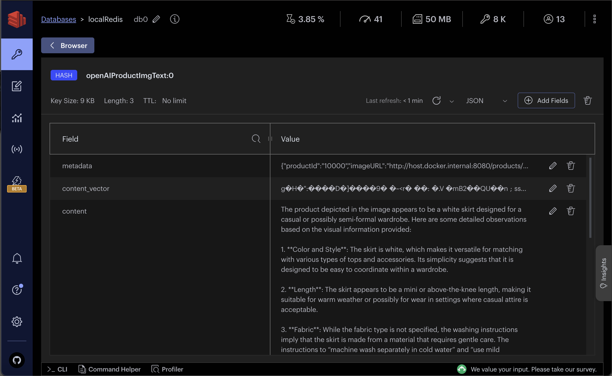
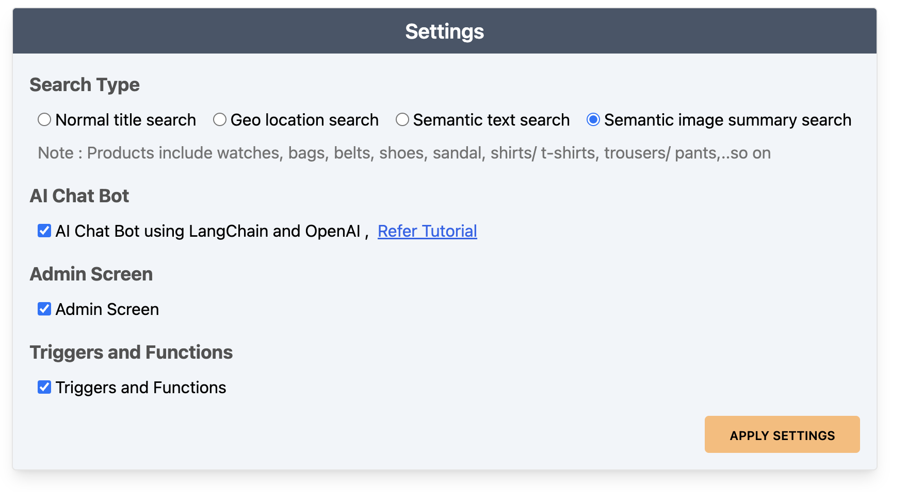
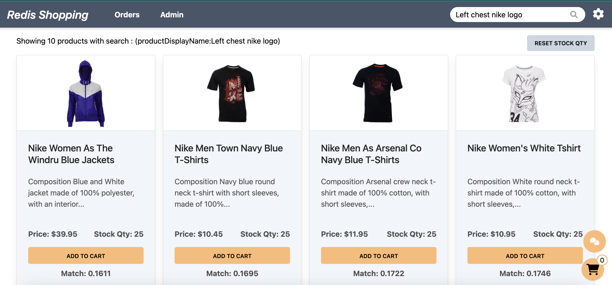

import Authors from '@theme/Authors';
import InitialMicroservicesArchitecture from '../../microservices/common-data/microservices-arch.mdx';
import MicroservicesEcommerceAIDesign from '../common-ai/microservices-ecommerce-ai.mdx';
import sampleProductImage from './images/product-img.webp';
import SourceCode from '../common-ai/microservices-source-code-ai.mdx';

<Authors frontMatter={frontMatter} />

## What you will learn in this tutorial

This tutorial demonstrates how to perform semantic search on product images using LangChain (OpenAI) and Redis. Specifically, we'll cover the following topics:

- **E-Commerce Application Context** : Consider a sample e-commerce application scenario where customers can utilize image-based queries for product searches, add items to their shopping cart, and complete purchases, thereby highlighting a real-world application of semantic search.

- **Database setup** : This involves generating descriptive summaries for product images, creating semantic embeddings for generated summaries and efficiently storing them in Redis.

- **Setting up the search API** : This API is designed to process user queries in the context of image content. It integrates the capabilities of OpenAI for semantic analysis with Redis for efficient data retrieval and storage.

## Terminology

**[LangChain](https://js.langchain.com)** is an innovative library for building language model applications. It offers a structured way to combine different components like language models (e.g., OpenAI's models), storage solutions (like Redis), and custom logic. This modular approach facilitates the creation of sophisticated AI applications.

**[OpenAI](https://openai.com/)** provides advanced language models like GPT-3, which have revolutionized the field with their ability to understand and generate human-like text. These models form the backbone of many modern AI applications including semantic text/ image search and chatbots.

## Microservices architecture for an e-commerce application

<SourceCode />

<InitialMicroservicesArchitecture />

## E-commerce application frontend using Next.js and Tailwind

<MicroservicesEcommerceAIDesign />

## Database setup

:::info
Sign up for an <u>[OpenAI account](https://platform.openai.com/)</u> to get your API key to be used in the demo (add OPEN_AI_API_KEY variable in .env file). You can also refer to the <u>[OpenAI API documentation](https://platform.openai.com/docs/api-reference/introduction)</u> for more information.
:::

<SourceCode />

### Sample data

In this tutorial, we'll use a simplified e-commerce dataset. Specifically, our JSON structure includes `product` details and a key named `styleImages_default_imageURL`, which links to an image of the product. This image will be the focus of our AI-driven semantic search.

```ts title="database/fashion-dataset/001/products/*.json"
const products = [
  {
    productId: '11000',
    price: 3995,
    productDisplayName: 'Puma Men Slick 3HD Yellow Black Watches',
    variantName: 'Slick 3HD Yellow',
    brandName: 'Puma',
    // Additional product details...
    styleImages_default_imageURL:
      'http://host.docker.internal:8080/images/11000.jpg',
    // Other properties...
  },
  // Additional products...
];
```

### Generating OpenAI image summary

The following code segment outlines the process of generating a text summary for a product image using OpenAI's capabilities. We'll first convert the image URL to a base64 string using `fetchImageAndConvertToBase64` function and then utilize OpenAI to generate a summary of the image using `getOpenAIImageSummary` function.

```ts title="database/src/open-ai-image.ts"
import {
  ChatOpenAI,
  ChatOpenAICallOptions,
} from 'langchain/chat_models/openai';
import { HumanMessage } from 'langchain/schema';
import { Document } from 'langchain/document';
import { OpenAIEmbeddings } from 'langchain/embeddings/openai';
import { RedisVectorStore } from 'langchain/vectorstores/redis';

let llm: ChatOpenAI<ChatOpenAICallOptions>;

// Instantiates the LangChain ChatOpenAI instance
const getOpenAIVisionInstance = (_openAIApiKey: string) => {
  //OpenAI supports  images with text in input messages with their gpt-4-vision-preview.
  if (!llm) {
    llm = new ChatOpenAI({
      openAIApiKey: _openAIApiKey,
      modelName: 'gpt-4-vision-preview',
      maxTokens: 1024,
    });
  }
  return llm;
};

const fetchImageAndConvertToBase64 = async (_imageURL: string) => {
  let base64Image = '';
  try {
    const response = await axios.get(_imageURL, {
      responseType: 'arraybuffer',
    });
    // Convert image to Base64
    base64Image = Buffer.from(response.data, 'binary').toString('base64');
  } catch (error) {
    console.error(
      `Error fetching or converting the image: ${_imageURL}`,
      error,
    );
  }
  return base64Image;
};

// Generates an OpenAI summary for a given base64 image string
const getOpenAIImageSummary = async (
  _openAIApiKey: string,
  _base64Image: string,
  _product: Prisma.ProductCreateInput,
) => {
  /*
     Reference : https://js.langchain.com/docs/integrations/chat/openai#multimodal-messages

    - This function utilizes OpenAI's multimodal capabilities to generate a summary from the image. 
    - It constructs a prompt that combines the product description with the image.
    - OpenAI's vision model then processes this prompt to generate a detailed summary.

   */
  let imageSummary = '';

  try {
    if (_openAIApiKey && _base64Image && _product) {
      const llmInst = getOpenAIVisionInstance(_openAIApiKey);

      const text = `Below are the product details and image of an e-commerce product for reference. Please conduct and provide a comprehensive analysis of the product depicted in the image . 
        
            Product Details:
            ${_product.productDescriptors_description_value}
            
            Image:
        `;
      // Constructing a multimodal message combining text and image
      const imagePromptMessage = new HumanMessage({
        content: [
          {
            type: 'text',
            text: text,
          },
          {
            type: 'image_url',
            image_url: {
              url: `data:image/jpeg;base64,${_base64Image}`,
              detail: 'high', // low, high (if you want more detail)
            },
          },
        ],
      });

      // Invoking the LangChain ChatOpenAI model with the constructed message
      const response = await llmInst.invoke([imagePromptMessage]);
      if (response?.content) {
        imageSummary = <string>response.content;
      }
    }
  } catch (err) {
    console.log(
      `Error generating OpenAIImageSummary for product id ${_product.productId}`,
      err,
    );
  }
  return imageSummary;
};
```

### Sample image & OpenAI summary

The following section demonstrates the result of the above process. We'll use the image of a Puma T-shirt and generate a summary using OpenAI's capabilities.


Comprehensive summary generated by the OpenAI model is as follows:

```txt
This product is a black round neck T-shirt featuring a design consistent with the Puma brand aesthetic, which includes their iconic leaping cat logo in a contrasting yellow color placed prominently across the chest area. The T-shirt is made from 100% cotton, suggesting it is likely to be breathable and soft to the touch. It has a classic short-sleeve design with a ribbed neckline for added texture and durability. There is also mention of a vented hem, which may offer additional comfort and mobility.

The T-shirt is described to have a 'comfort' fit, which typically means it is designed to be neither too tight nor too loose, allowing for ease of movement without being baggy. This could be ideal for casual wear or active use.

Care instructions are also comprehensive, advising a gentle machine wash with similar colors in cool water at 30 degrees Celsius, indicating it is relatively easy to care for. However, one should avoid bleaching, tumble drying, and dry cleaning it, but a warm iron is permissible.

Looking at the image provided:

- The T-shirt appears to fit the model well, in accordance with the described 'comfort' fit.
- The color contrast between the T-shirt and the graphic gives the garment a modern, sporty look.
- The model is paired with denim jeans, showcasing the T-shirt's versatility for casual occasions. However, the product description suggests it can be part of an athletic ensemble when combined with Puma shorts and shoes.
- Considering the model's statistics, prospective buyers could infer how this T-shirt might fit on a person with similar measurements.

Overall, the T-shirt is positioned as a versatile item suitable for both lifestyle and sporting activities, with a strong brand identity through the graphic, and is likely comfortable and easy to maintain based on the product details provided.
```

### Seeding Image summary embeddings

The `addImageSummaryEmbeddingsToRedis` function plays a critical role in integrating AI-generated image summaries with Redis. This process involves two main steps:

1. **Generating Vector Documents**: Utilizing the `getImageSummaryVectorDocuments` function, we transform image summaries into vector documents. This transformation is crucial as it converts textual summaries into a format suitable for Redis storage.

1. **Seeding Embeddings into Redis**: The `seedImageSummaryEmbeddings` function is then employed to store these vector documents into Redis. This step is essential for enabling efficient retrieval and search capabilities within the Redis database.

```ts
// Function to generate vector documents from image summaries
const getImageSummaryVectorDocuments = async (
  _products: Prisma.ProductCreateInput[],
  _openAIApiKey: string,
) => {
  const vectorDocs: Document[] = [];

  if (_products?.length > 0) {
    let count = 1;
    for (let product of _products) {
      if (product) {
        let imageURL = product.styleImages_default_imageURL; //cdn url
        const imageData = await fetchImageAndConvertToBase64(imageURL);
        imageSummary = await getOpenAIImageSummary(
          _openAIApiKey,
          imageData,
          product,
        );
        console.log(
          `openAI imageSummary #${count++} generated for product id: ${
            product.productId
          }`,
        );

        if (imageSummary) {
          let doc = new Document({
            metadata: {
              productId: product.productId,
              imageURL: imageURL,
            },
            pageContent: imageSummary,
          });
          vectorDocs.push(doc);
        }
      }
    }
  }
  return vectorDocs;
};

// Seeding vector documents into Redis
const seedImageSummaryEmbeddings = async (
  vectorDocs: Document[],
  _redisClient: NodeRedisClientType,
  _openAIApiKey: string,
) => {
  if (vectorDocs?.length && _redisClient && _openAIApiKey) {
    const embeddings = new OpenAIEmbeddings({
      openAIApiKey: _openAIApiKey,
    });
    const vectorStore = await RedisVectorStore.fromDocuments(
      vectorDocs,
      embeddings,
      {
        redisClient: _redisClient,
        indexName: 'openAIProductImgIdx',
        keyPrefix: 'openAIProductImgText:',
      },
    );
    console.log('seeding imageSummaryEmbeddings completed');
  }
};

const addImageSummaryEmbeddingsToRedis = async (
  _products: Prisma.ProductCreateInput[],
  _redisClient: NodeRedisClientType,
  _openAIApiKey: string,
) => {
  const vectorDocs = await getImageSummaryVectorDocuments(
    _products,
    _openAIApiKey,
  );

  await seedImageSummaryEmbeddings(vectorDocs, _redisClient, _openAIApiKey);
};
```

The image below shows the JSON structure of **openAI image summary** within RedisInsight.


:::tip

Download <u>[RedisInsight](https://redis.com/redis-enterprise/redis-insight/)</u> to visually explore your Redis data or to engage with raw Redis commands in the workbench.

:::

## Setting up the search API

### API end point

This section covers the API request and response structure for `getProductsByVSSImageSummary`, which is essential for retrieving products based on semantic search using image summaries.

**Request Format**

The example request format for the API is as follows:

```json
POST http://localhost:3000/products/getProductsByVSSImageSummary
{
   "searchText":"Left chest nike logo",

   //optional
   "maxProductCount": 4, // 2 (default)
   "similarityScoreLimit":0.2, // 0.2 (default)
}
```

**Response Structure**

The response from the API is a JSON object containing an array of product details that match the semantic search criteria:

```json
{
  "data": [
    {
      "productId": "10017",
      "price": 3995,
      "productDisplayName": "Nike Women As The Windru Blue Jackets",
      "brandName": "Nike",
      "styleImages_default_imageURL": "http://host.docker.internal:8080/products/01/10017/product-img.webp",
      "productDescriptors_description_value": " Blue and White jacket made of 100% polyester, with an interior pocket ...",
      "stockQty": 25,
      "similarityScore": 0.163541972637,
      "imageSummary": "The product in the image is a blue and white jacket featuring a design consistent with the provided description. ..."
    }
    // Additional products...
  ],
  "error": null,
  "auth": "SES_fd57d7f4-3deb-418f-9a95-6749cd06e348"
}
```

### API implementation

The backend implementation of this API involves following steps:

1. `getProductsByVSSImageSummary` function handles the API Request.
1. `getSimilarProductsScoreByVSSImageSummary` function performs semantic search on image summaries. It integrates with `OpenAI's` semantic analysis capabilities to interpret the searchText and identify relevant products from `Redis` vector store.

```ts title="server/src/services/products/src/open-ai-prompt.ts"
const getSimilarProductsScoreByVSSImageSummary = async (
  _params: IParamsGetProductsByVSS,
) => {
  let {
    standAloneQuestion,
    openAIApiKey,

    //optional
    KNN,
    scoreLimit,
  } = _params;

  let vectorDocs: Document[] = [];
  const client = getNodeRedisClient();

  KNN = KNN || 2;
  scoreLimit = scoreLimit || 1;

  const embeddings = new OpenAIEmbeddings({
    openAIApiKey: openAIApiKey,
  });

  // create vector store
  const vectorStore = new RedisVectorStore(embeddings, {
    redisClient: client,
    indexName: 'openAIProductImgIdx',
    keyPrefix: 'openAIProductImgText:',
  });

  // search for similar products
  const vectorDocsWithScore = await vectorStore.similaritySearchWithScore(
    standAloneQuestion,
    KNN,
  );

  // filter by scoreLimit
  for (let [doc, score] of vectorDocsWithScore) {
    if (score <= scoreLimit) {
      doc['similarityScore'] = score;
      vectorDocs.push(doc);
    }
  }

  return vectorDocs;
};
```

```ts title="server/src/services/products/src/service-impl.ts"
const getProductsByVSSImageSummary = async (
  productsVSSFilter: IProductsVSSBodyFilter,
) => {
  let { searchText, maxProductCount, similarityScoreLimit } = productsVSSFilter;
  let products: IProduct[] = [];

  const openAIApiKey = process.env.OPEN_AI_API_KEY || '';
  maxProductCount = maxProductCount || 2;
  similarityScoreLimit = similarityScoreLimit || 0.2;

  //VSS search
  const vectorDocs = await getSimilarProductsScoreByVSSImageSummary({
    standAloneQuestion: searchText,
    openAIApiKey: openAIApiKey,
    KNN: maxProductCount,
    scoreLimit: similarityScoreLimit,
  });

  if (vectorDocs?.length) {
    const productIds = vectorDocs.map((doc) => doc?.metadata?.productId);

    //get product with details
    products = await getProductByIds(productIds, true);
  }

  //...

  return products;
};
```

### Frontend UI

- **Settings configuration**: Initially, ensure that the `Semantic image summary search` option is enabled in the settings page.
  

- **Performing a search**: On the dashboard page, users can conduct searches using image-based queries. For example, if the query is `Left chest nike logo`, the search results will display products like a Nike jacket, characterized by a logo on its left chest, reflecting the query.

  

- **Viewing image summaries**: Users can click on any product image to view the corresponding image summary generated by OpenAI. This feature offers an insightful glimpse into how AI interprets and summarizes visual content.
  

## Ready to use Redis for semantic image based queries?

Performing semantic search on image summaries is a powerful tool for e-commerce applications. It allows users to search for products based on their descriptions or images, enabling a more intuitive and efficient shopping experience. This tutorial has demonstrated how to integrate OpenAI's semantic analysis capabilities with Redis to create a robust search engine for e-commerce applications.

## Further reading

- [Perform vector similarity search using Redis](/howtos/solutions/vector/getting-started-vector)

- [LangChain JS](https://js.langchain.com/docs/get_started/quickstart)
  - [Learn LangChain](https://scrimba.com/learn/langchain)
- [LangChain redis integration](https://js.langchain.com/docs/integrations/vectorstores/redis)
