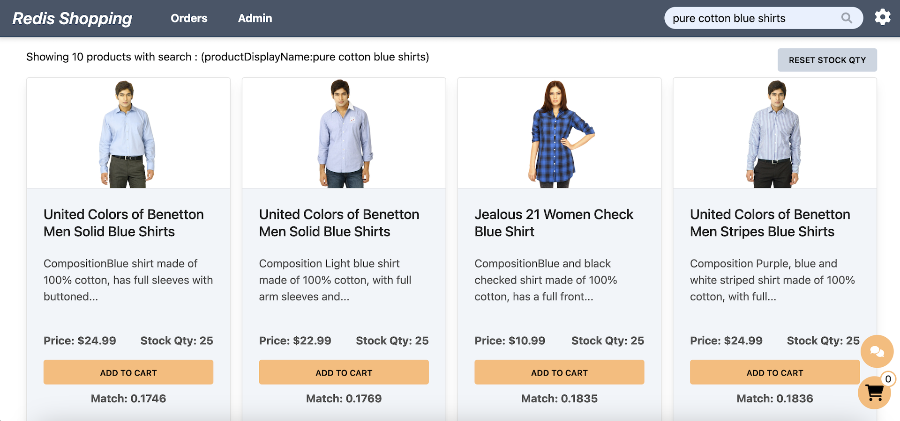

import Authors from '@theme/Authors';
import InitialMicroservicesArchitecture from '../../microservices/common-data/microservices-arch.mdx';
import MicroservicesEcommerceAIDesign from '../common-ai/microservices-ecommerce-ai.mdx';
import SourceCode from '../common-ai/microservices-source-code-ai.mdx';

<Authors frontMatter={frontMatter} />

## What you will learn in this tutorial

This tutorial demonstrates how to perform semantic text search on product description using LangChain (OpenAI) and Redis. Specifically, we'll cover the following topics:

- **E-Commerce Application Context** : Consider a sample e-commerce application scenario where customers can perform semantic text search on product details, add items to their shopping cart, and complete purchases, thereby highlighting a real-world application of semantic search.

- **Database setup** : This involves generating semantic embeddings for product details and efficiently storing them in Redis.

- **Setting up the search API** : This API is designed to process user queries in the context of product details. It integrates the capabilities of OpenAI for semantic analysis with Redis for efficient data retrieval and storage.

## Terminology

**[LangChain](https://js.langchain.com)** is an innovative library for building language model applications. It offers a structured way to combine different components like language models (e.g., OpenAI's models), storage solutions (like Redis), and custom logic. This modular approach facilitates the creation of sophisticated AI applications.

**[OpenAI](https://openai.com/)** provides advanced language models like GPT-3, which have revolutionized the field with their ability to understand and generate human-like text. These models form the backbone of many modern AI applications including semantic text/ image search and chatbots.

## Microservices architecture for an e-commerce application

<SourceCode />

<InitialMicroservicesArchitecture />

## E-commerce application frontend using Next.js and Tailwind

<MicroservicesEcommerceAIDesign />

## Database setup

:::info
Sign up for an <u>[OpenAI account](https://platform.openai.com/)</u> to get your API key to be used in the demo (add OPEN_AI_API_KEY variable in .env file). You can also refer to the <u>[OpenAI API documentation](https://platform.openai.com/docs/api-reference/introduction)</u> for more information.
:::

<SourceCode />

### Sample data

For the purposes of this tutorial, let's consider a simplified e-commerce context. The `products` JSON provided offers a glimpse into AI search functionalities we'll be operating on.

```ts title="database/fashion-dataset/001/products/*.json"
const products = [
  {
    productId: '11000',
    price: 3995,
    productDisplayName: 'Puma Men Slick 3HD Yellow Black Watches',
    variantName: 'Slick 3HD Yellow',
    brandName: 'Puma',
    ageGroup: 'Adults-Men',
    gender: 'Men',
    displayCategories: 'Accessories',
    masterCategory_typeName: 'Accessories',
    subCategory_typeName: 'Watches',
    styleImages_default_imageURL:
      'http://host.docker.internal:8080/images/11000.jpg',
    productDescriptors_description_value: 'Stylish and comfortable, ...',
    stockQty: 25,
  },
  //...
];
```

### Seeding product details embeddings

The `addEmbeddingsToRedis` function plays a critical role in integrating AI-generated product details embeddings with Redis. This process involves two main steps:

1. **Generating Vector Documents**: Utilizing the `convertToVectorDocuments` function, we transform product details into vector documents. This transformation is crucial as it converts product details into a format suitable for Redis storage.

1. **Seeding Embeddings into Redis**: The `seedOpenAIEmbeddings` function is then employed to store these vector documents into Redis. This step is essential for enabling efficient retrieval and search capabilities within the Redis database.

```ts
import { Document } from 'langchain/document';
import { OpenAIEmbeddings } from 'langchain/embeddings/openai';
import { RedisVectorStore } from 'langchain/vectorstores/redis';

const convertToVectorDocuments = async (
  _products: Prisma.ProductCreateInput[],
) => {
  const vectorDocs: Document[] = [];

  if (_products?.length > 0) {
    for (let product of _products) {
      let doc = new Document({
        metadata: {
          productId: product.productId,
        },
        pageContent: ` Product details are as follows:
                productId: ${product.productId}.
    
                productDisplayName: ${product.productDisplayName}.
                
                price: ${product.price}.
    
                variantName: ${product.variantName}.
    
                brandName: ${product.brandName}.
    
                ageGroup: ${product.ageGroup}.
    
                gender: ${product.gender}.
    
                productColors: ${product.productColors}
    
                Category:  ${product.displayCategories}, ${product.masterCategory_typeName} - ${product.subCategory_typeName}
    
                productDescription:  ${product.productDescriptors_description_value}`,
      });

      vectorDocs.push(doc);
    }
  }
  return vectorDocs;
};

const seedOpenAIEmbeddings = async (
  vectorDocs: Document[],
  _redisClient: NodeRedisClientType,
  _openAIApiKey: string,
) => {
  if (vectorDocs?.length && _redisClient && _openAIApiKey) {
    console.log('openAIEmbeddings started !');

    const embeddings = new OpenAIEmbeddings({
      openAIApiKey: _openAIApiKey,
    });
    const vectorStore = await RedisVectorStore.fromDocuments(
      vectorDocs,
      embeddings,
      {
        redisClient: _redisClient,
        indexName: 'openAIProductsIdx',
        keyPrefix: 'openAIProducts:',
      },
    );
    console.log('OpenAIEmbeddings completed');
  }
};

const addEmbeddingsToRedis = async (
  _products: Prisma.ProductCreateInput[],
  _redisClient: NodeRedisClientType,
  _openAIApiKey: string,
  _huggingFaceApiKey?: string,
) => {
  if (_products?.length > 0 && _redisClient && _openAIApiKey) {
    const vectorDocs = await convertToVectorDocuments(_products);

    await seedOpenAIEmbeddings(vectorDocs, _redisClient, _openAIApiKey);
  }
};
```

The image below shows the JSON structure of openAI product details within RedisInsight.


:::tip

Download <u>[RedisInsight](https://redis.com/redis-enterprise/redis-insight/)</u> to visually explore your Redis data or to engage with raw Redis commands in the workbench.

:::

## Setting up the search API

### API end point

This section covers the API request and response structure for `getProductsByVSSText`, which is essential for retrieving products based on semantic text search.

**Request Format**

The example request format for the API is as follows:

```json
POST http://localhost:3000/products/getProductsByVSSText
{
   "searchText":"pure cotton blue shirts",

   //optional
   "maxProductCount": 4, // 2 (default)
   "similarityScoreLimit":0.1, // 0.1 (default)
}
```

**Response Structure**

The response from the API is a JSON object containing an array of product details that match the semantic search criteria:

```json
{
  "data": [
    {
      "productId": "11031",
      "price": 1099,
      "productDisplayName": "Jealous 21 Women Check Blue Tops",
      "productDescriptors_description_value": "Composition : Green and navy blue checked round neck blouson tunic top made of 100% cotton, has a full buttoned placket, three fourth sleeves with buttoned cuffs and a belt below the waist<br /><br /><strong>Fitting</strong><br />Regular<br /><br /><strong>Wash care</strong><br />Machine/hand wash separately in mild detergent<br />Do not bleach or wring<br />Dry in shade<br />Medium iron<br /><br />If you're in the mood to have some checked fun, this blouson tunic top from jealous 21 will fulfil your heart's desire with &eacute;lan. The cotton fabric promises comfort, while the smart checks guarantee unparalleled attention. Pair this top with leggings and ballerinas for a cute, neat look.<br /><br /><em>Model statistics</em><br />The model wears size M in tops<br />Height: 5'7\"; Chest: 33\"; Waist: 25\"</p>",
      "stockQty": 25,
      "productColors": "Blue,Green",
      "similarityScore": 0.168704152107
      //...
    }
  ],
  "error": null,
  "auth": "SES_fd57d7f4-3deb-418f-9a95-6749cd06e348"
}
```

### API implementation

The backend implementation of this API involves following steps:

1. `getProductsByVSSText` function handles the API Request.
1. `getSimilarProductsScoreByVSS` function performs semantic search on product details. It integrates with `OpenAI's` semantic analysis capabilities to interpret the searchText and identify relevant products from `Redis` vector store.

```ts title="server/src/services/products/src/open-ai-prompt.ts"
const getSimilarProductsScoreByVSS = async (
  _params: IParamsGetProductsByVSS,
) => {
  let {
    standAloneQuestion,
    openAIApiKey,

    //optional
    KNN,
    scoreLimit,
  } = _params;

  let vectorDocs: Document[] = [];
  const client = getNodeRedisClient();

  KNN = KNN || 2;
  scoreLimit = scoreLimit || 0;

  let embeddings = new OpenAIEmbeddings({
    openAIApiKey: openAIApiKey,
  });
  let indexName = 'openAIProductsIdx';
  let keyPrefix = 'openAIProducts:';

  if (embeddings) {
    // create vector store
    const vectorStore = new RedisVectorStore(embeddings, {
      redisClient: client,
      indexName: indexName,
      keyPrefix: keyPrefix,
    });

    // search for similar products
    const vectorDocsWithScore = await vectorStore.similaritySearchWithScore(
      standAloneQuestion,
      KNN,
    );

    // filter by scoreLimit
    for (let [doc, score] of vectorDocsWithScore) {
      if (score <= scoreLimit) {
        doc['similarityScore'] = score;
        vectorDocs.push(doc);
      }
    }
  }

  return vectorDocs;
};
```

```ts title="server/src/services/products/src/service-impl.ts"
const getProductsByVSSText = async (
  productsVSSFilter: IProductsVSSBodyFilter,
) => {
  let { searchText, maxProductCount, similarityScoreLimit } = productsVSSFilter;
  let products: IProduct[] = [];

  const openAIApiKey = process.env.OPEN_AI_API_KEY || '';
  maxProductCount = maxProductCount || 2;
  similarityScoreLimit = similarityScoreLimit || 0.1;

  if (!openAIApiKey) {
    throw new Error('Please provide openAI API key in .env file');
  }

  if (!searchText) {
    throw new Error('Please provide search text');
  }

  //VSS search
  const vectorDocs = await getSimilarProductsScoreByVSS({
    standAloneQuestion: searchText,
    openAIApiKey: openAIApiKey,
    KNN: maxProductCount,
    scoreLimit: similarityScoreLimit,
  });

  if (vectorDocs?.length) {
    const productIds = vectorDocs.map((doc) => doc?.metadata?.productId);

    //get product with details
    products = await getProductByIds(productIds, true);
  }

  //...

  return products;
};
```

### Frontend UI

- **Settings configuration**: Initially, ensure that the `Semantic text search` option is enabled in the settings page.
  

- **Performing a search**: On the dashboard page, users can conduct searches using semantic text. For example, if the query is `pure cotton blue shirts`, the search results will display products like men and women blue shirts, as shown below.

  

- **Viewing product description**: Users can click on any product description to view full description details.

## Ready to use Redis for semantic text search?

Performing semantic text search is a powerful tool for e-commerce applications. It allows users to search for products based on their descriptions, enabling a more intuitive and efficient shopping experience. This tutorial has demonstrated how to integrate OpenAI's semantic analysis capabilities with Redis to create a robust search engine for e-commerce applications.

## Further reading

- [Perform vector similarity search using Redis](/howtos/solutions/vector/getting-started-vector)
- [Semantic Image Based Queries Using LangChain (OpenAI) and Redis](/howtos/solutions/vector/image-summary-search)

- [LangChain JS](https://js.langchain.com/docs/get_started/quickstart)
  - [Learn LangChain](https://scrimba.com/learn/langchain)
- [LangChain redis integration](https://js.langchain.com/docs/integrations/vectorstores/redis)
