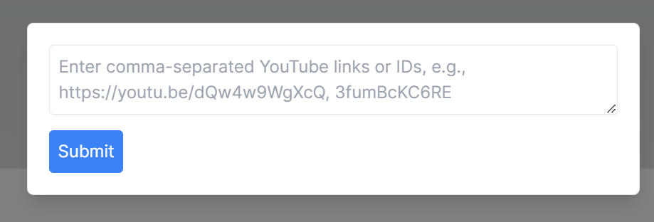
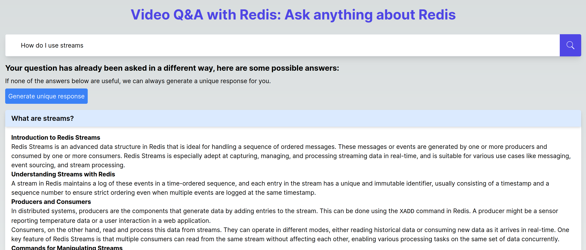

import Authors from '@theme/Authors';

<Authors frontMatter={frontMatter} />

## What you will learn in this tutorial

This tutorial focuses on building a Q&A answer engine for video content. It will cover the following topics:

1. How to use `OpenAI`, `Google Gemini`, and `LangChain` to summarize videos content and generate vector embeddings
1. How to use `Redis` to store and search vector embeddings
1. How to use `Redis` as a semantic vector search cache

:::tip GITHUB CODE

Below is a command to the clone the source code for the application used in this tutorial

```bash
git clone https://github.com/wjohnsto/genai-qa-videos
```

:::

## Introduction

Before we dive into the details of this tutorial, let's go over a few concepts that are important to understand when building generative AI applications.

1. **Generative AI** is a rapidly evolving field that focuses on creating content, whether it's text, images, or even video. It leverages deep learning techniques to generate new, unique outputs based on learned patterns and data.
1. **Retrieval-Augmented Generation (RAG)** combines generative models with external knowledge sources to provide more accurate and informed responses. This technique is particularly useful in applications where context-specific information is critical.
1. [**LangChain**](https://www.langchain.com/) is a powerful library that facilitates the development of applications involving language models. It simplifies tasks such as summarization, question answering, and interaction with generative models like ChatGPT or Google Gemini.
1. **Google Gemini** and **OpenAI/ChatGPT** are generative models that can be used to generate text based on a given prompt. They are useful for applications that require a large amount of text generation, such as summarization or question answering.
1. **Semantic vector search** is a technique that uses vector embeddings to find similar items in a database. It is typically combined with RAG to provide more accurate responses to user queries.
1. **Redis** is an in-memory database that can be used to store and search vector embeddings. It is particularly useful for applications that require fast, real-time responses.

Our application leverages these technologies to create a unique Q&A platform based on video content. Users can upload YouTube video URLs or IDs, and the application utilizes generative AI to summarize these videos, formulate potential questions, and create a searchable database. This database can then be queried to find answers to user-submitted questions, drawing directly from the video content.

## High-level overview of the AI video Q&A application with Redis

Here's how our application uses AI and semantic vector search to answer user questions based on video content:

1. **Uploading videos**: Users can upload YouTube videos either via links (e.g. `https://www.youtube.com/watch?v=LaiQFZ5bXaM`) or video IDs (e.g. `LaiQFZ5bXaM`). The application processes these inputs to retrieve necessary video information.


2. **Video processing and AI interaction**: Using the [Youtube Data API](https://developers.google.com/youtube/v3), the application obtains video `titles`, `descriptions`, and `thumbnails`. It also uses [SearchAPI.io](https://searchapi.io) to retrieve video transcripts. These transcripts are then passed to a large language model (LLM) - either Google Gemini or OpenAI's ChatGPT - for summarization and sample question generation. The LLM also generates vector embeddings for these summaries.

An example summary and sample questions generated by the LLM are shown below:

```markdown title="https://www.youtube.com/watch?v=LaiQFZ5bXaM"
### Summary:

The video demonstrates how Redis Stack can be utilized to build complex real-time applications by turning Redis into a multi-model database. This capability is showcased through the development of a stock watchlist application, which utilizes various data types and models supported by Redis Stack, such as JSON documents, time series data, and probabilistic data structures. Key features of the app include real-time updates on stock prices, trending stocks based on trade frequency, and news updates, all powered by Redis Stack in combination with the Alpaca API for stock data. The application's architecture is explained, highlighting the use of Redis Stack for data storage, Pub/Sub for inter-service communication, and websockets for real-time front-end updates. Some coding aspects are touched upon, emphasizing how Redis Stack simplifies the handling of complex data structures and real-time data flow.

### Example Questions and Answers:

**Q1: How does Redis Stack enhance Redis to support real-time applications?**
A1: Redis Stack transforms Redis into a multi-model database, adding support for various data types like JSON, time series, and probabilistic data structures, facilitating complex data management and inter-service communication in real-time applications.

**Q2: Can you explain how the sample stock watchlist application uses Redis Stack?**
A2: The stock watchlist application leverages Redis Stack as its primary database and message broker. It uses Redis for storing different data types, such as JSON documents for stock metadata and time series data for stock prices. It also utilizes Pub/Sub for real-time updates between microservices, enhancing its ability to track and display stock information dynamically.

**Q3: What are some key features of the stock watchlist application demonstrated in the video?**
A3: Key features include the ability to add and remove stocks from a watchlist, view real-time trading data, check trending stocks based on trade frequency, access up-to-date news for each stock, and display detailed charts for stock prices over time, all updated in real-time thanks to Redis Stack and the Alpaca API.

**Q4: How does the application's architecture support its real-time functionality?**
A4: The application's architecture includes a front end for displaying data, an API service for communication between the front end and Redis Stack, and a streaming service handling real-time data from the Alpaca API. Redis Stack's capabilities for data storage, retrieval, and real-time updates, along with its Pub/Sub system, enable efficient real-time functionality across the application.

**Q5: Can you provide details on how trending stocks are determined and updated in the application?**
A5: Trending stocks are determined using Redis Stack's Top K feature, which automatically builds a leaderboard of the most frequently traded stocks in the watchlist. This list is updated every minute based on new trade data received from the Alpaca API. Changes to the leaderboard are published via Pub/Sub, prompting the front end to display the latest trending stocks in real time.

**Q6: What technologies were used in the front end of the application?**
A6: The front end of the application was developed using Next.js, with Tailwind CSS for styling and Chart.js for rendering stock price charts. It connects to the backend using websockets to receive real-time updates on stock data.

**Q7: How does Redis Stack enable querying of time series data in the application?**
A7: Redis Stack provides time series capabilities, allowing for efficient storage and querying of time-based data. In the application, time series data is used to store stock prices, which can be queried over a specific date range or used to obtain the latest trade price, facilitating the dynamic update of stock charts and price information in real time.
```

3. **Data storage with Redis**: All generated data, including video summaries, potential questions, and vector embeddings, are stored in Redis. The app utilizes Redis's diverse data types for efficient data handling, caching, and quick retrieval.


4. **Search and answer retrieval**: The frontend, built with Next.js, allows users to ask questions. The application then searches the Redis database using semantic vector similarity to find relevant video content. It further uses the LLM to formulate answers, prioritizing information from video transcripts.


5. **Presentation of results**: The app displays the most relevant videos along with the AI-generated answers, offering a comprehensive and interactive user experience. It also displays cached results from previous queries using semantic vector caching for faster response times.




## Setting Up the Environment

To get started with our AI-powered video Q&A application, you'll first need to set up your development environment. We'll follow the instructions outlined in the project's `README.md` file.

### Requirements

- [Node.js](https://nodejs.org/)
- [Docker](https://www.docker.com/)
- [SearchAPI.io API Key](https://www.searchapi.io/)
  - This is used to retrieve video transcripts and free for up to 100 requests. The application will cache the results to help avoid exceeding the free tier.
- [Google API Key](https://console.cloud.google.com/apis/credentials)
  - You must have the following APIs enabled:
    - YouTube Data API v3
    - Generative Language API
  - This is used to retrieve video information and prompt the Google Gemini model. This is not free.
- [OpenAI API Key](https://platform.openai.com/api-keys)
  - This is used to prompt the OpenAI ChatGPT model. This is not free.

### Setting Up Redis

Redis is used as our database to store and retrieve data efficiently. You can start quickly with a cloud-hosted Redis instance by signing up at redis.com/try-free. This is ideal for both development and testing purposes. You can easily store the data for this application within the limitations of the Redis free tier.

### Cloning the Repository

First, clone the repository containing our project:

```bash
git clone https://github.com/wjohnsto/genai-qa-videos
```

### Installing Dependencies

After setting up your Node.js environment, you'll need to install the necessary packages. Navigate to the root of your project directory and run the following command:

```bash
npm install
```

This command will install all the dependencies listed in the `package.json` file, ensuring you have everything needed to run the application.

### Configuration

Before running the application, make sure to configure the environment variables. There is a script to automatically generate the `.env` files for you. Run the following command:

```bash
npm run setup
```

This will generate the following files:

1. `app/.env` - This file contains the environment variables for the Next.js application.
1. `app/.env.docker` - This file contains overrides for the environment variables when running in Docker.
1. `services/video-search/.env` - This file contains the environment variables for the video search service.
1. `services/video-search/.env.docker` - This file contains overrides for the environment variables when running in Docker.

By default, you should not need to touch the environment files in the `app`. However, you will need to configure the environment files in the `services/video-search` directory.

The `services/video-search/.env` looks like this:

```bash
USE=<HF|OPENAI>

REDIS_URL=<redis[s]://[[username][:password]@][host][:port][/db-number]>
SEARCHAPI_API_KEY=<https://www.searchapi.io/>
YOUTUBE_TRANSCRIPT_PREFIX=<redis-transcript-prefix>
YOUTUBE_VIDEO_INFO_PREFIX=<redis-video-info-prefix>

GOOGLE_API_KEY=<https://console.cloud.google.com/apis/credentials>
GOOGLE_EMBEDDING_MODEL=<https://ai.google.dev/models/gemini#model_variations>
GOOGLE_SUMMARY_MODEL=<https://ai.google.dev/models/gemini#model_variations>

OPENAI_API_KEY=<https://platform.openai.com/api-keys>
OPENAI_ORGANIZATION=<https://platform.openai.com/account/organization>
OPENAI_EMBEDDING_MODEL=<https://platform.openai.com/account/limits>
OPENAI_SUMMARY_MODEL=<https://platform.openai.com/account/limits>
```

For Gemini models, you can use the following if you are not sure what to do:

```bash
GOOGLE_EMBEDDING_MODEL=embedding-001
GOOGLE_SUMMARY_MODEL=gemini-pro
```

For OpenAI models, you can use the following if you are not sure what to do:

```bash
OPENAI_EMBEDDING_MODEL=text-embedding-ada-002
OPENAI_SUMMARY_MODEL=gpt-4-1106-preview
```

> NOTE: Depending on your OpenAI tier you may have to use a different summary model. `gpt-3.5` models will be okay.

The `_PREFIX` environment variables are used to prefix the keys in Redis. This is useful if you want to use the same Redis instance for multiple applications. THey have the following defaults:

```bash
YOUTUBE_TRANSCRIPT_PREFIX=transcripts:
YOUTUBE_VIDEO_INFO_PREFIX=yt-videos:
```

If you're satisfied with the defaults, you can delete these values from the `.env` file.

Lastly, the `services/video-search/.env.docker` file contains overrides for the Redis URL when used in Docker. By default this app sets up a local Redis instance in Docker. If you are using a cloud instance, you can simply add the URL to your `.env` and delete the override in the `.env.docker` file.

## Running the application

After installing and configuring the application, run the following command to build the Docker images and run containers:

```bash
npm run dev
```

This command builds the app and the video service, and deploys them to Docker. It is all setup for hot reloading, so if you make changes to the code, it will automatically restart the servers.

Once the containers are up and running, the application will be accessible via your web browser:

- **Client**: Available at [http://localhost](http://localhost) (Port 80).
- **Video search service**: Accessible at [http://localhost:8000](http://localhost:8000/api/healthcheck).

This setup allows you to interact with the client-side application through your browser and make requests to the video search service hosted on a separate port.

The video search service doesn't publish a client application. Instead, it exposes a REST API that can be used to interact with the service. You can validate that it is running by checking Docker or by visiting the following URL:

- [http://localhost:8000/api/healthcheck](http://localhost:8000/api/healthcheck)

You should be up and running now! The rest of this tutorial is focused on how the application works and how to use it, with code examples.

## How to build a video Q&A application with Redis and LangChain

### Video uploading and processing

#### Handling video uploads and retreiving video transcripts and metadata

The backend is set up to handle YouTube video links or IDs. The relevant code snippet from the project demonstrates how these inputs are processed.

```typescript title="services/video-search/src/transcripts/load.ts"
export type VideoDocument = Document<{
  id: string;
  link: string;
  title: string;
  description: string;
  thumbnail: string;
}>;

export async function load(videos: string[] = config.youtube.VIDEOS) {
  // Parse the video URLs to get a list of video IDs
  const videosToLoad: string[] = videos.map(parseVideoUrl).filter((video) => {
    return typeof video === 'string';
  }) as string[];

  // Get video title, description, and thumbail from YouTube API v3
  const videoInfo = await getVideoInfo(videosToLoad);

  // Get video transcripts from SearchAPI.io, join the video info
  const transcripts = await mapAsyncInOrder(videosToLoad, async (video) => {
    return await getTranscript(video, videoInfo[video]);
  });

  // Return the videos as documents with metadata, and pageContent being the transcript
  return transcripts.filter(
    (transcript) => typeof transcript !== 'undefined',
  ) as VideoDocument[];
}
```

In the same file you will see two caches:

```typescript title="services/video-search/src/transcripts/load.ts"
const cache = cacheAside(config.youtube.TRANSCRIPT_PREFIX);
const videoCache = jsonCacheAside<VideoInfo>(config.youtube.VIDEO_INFO_PREFIX);
```

These caches are used to store the transcripts (as a `string`) and video metadata (as `JSON`) in Redis. The `cache` functions are helper functions that use Redis to store and retrieve data. They looks like this:

```typescript title="services/video-search/src/db.ts"
export function cacheAside(prefix: string) {
  return {
    get: async (key: string) => {
      return await client.get(`${prefix}${key}`);
    },
    set: async (key: string, value: string) => {
      return await client.set(`${prefix}${key}`, value);
    },
  };
}

export function jsonCacheAside<T>(prefix: string) {
  return {
    get: async (key: string): Promise<T | undefined> => {
      return client.json.get(`${prefix}${key}`) as T;
    },
    set: async (key: string, value: RedisJSON) => {
      return await client.json.set(`${prefix}${key}`, '$', value);
    },
  };
}
```

You will see these functions used elsewhere in the app. They are used to prevent unnecessary API calls, in this case to SearchAPI.io and the YouTube API.

#### Summarizing video content with LangChain, Redis, Google Gemini, and OpenAI ChatGPT

After obtaining the video transcripts and metadata, the transcripts are then summarized using LangChain and the LLMs, both Gemini and ChatGPT. There are a few interesting pieces of code to understand here:

1. The `prompt` used to ask the LLM to summarize the video transcript and generate sample questions
1. The `refinement chain` used to obtain the summarized video and sample questions
1. The `vector embedding chain` that uses the LLM to generate text embeddings and store them in Redis

The LLM `summary prompt` is split into two parts. This is done to allow analyzing videos where the transcript length is larger than the LLM's accepted context.

```typescript title="services/video-search/src/api/templates/video.ts"
import { PromptTemplate } from 'langchain/prompts';

const summaryTemplate = `
You are an expert in summarizing YouTube videos.
Your goal is to create a summary of a video.
Below you find the transcript of a video:
--------
{text}
--------

The transcript of the video will also be used as the basis for a question and answer bot.
Provide some examples questions and answers that could be asked about the video. Make these questions very specific.

Total output will be a summary of the video and a list of example questions the user could ask of the video.

SUMMARY AND QUESTIONS:
`;

export const SUMMARY_PROMPT = PromptTemplate.fromTemplate(summaryTemplate);

const summaryRefineTemplate = `
You are an expert in summarizing YouTube videos.
Your goal is to create a summary of a video.
We have provided an existing summary up to a certain point: {existing_answer}

Below you find the transcript of a video:
--------
{text}
--------

Given the new context, refine the summary and example questions.
The transcript of the video will also be used as the basis for a question and answer bot.
Provide some examples questions and answers that could be asked about the video. Make
these questions very specific.
If the context isn't useful, return the original summary and questions.
Total output will be a summary of the video and a list of example questions the user could ask of the video.

SUMMARY AND QUESTIONS:
`;

export const SUMMARY_REFINE_PROMPT = PromptTemplate.fromTemplate(
  summaryRefineTemplate,
);
```

The `summary prompts` are used to create a `refinement chain` with LangChain. LangChain will automatically handle splitting the video transcript document(s) and calling the LLM accordingly.

```typescript title="services/video-search/src/api/prompt.ts" {1-5,30-35}
const videoSummarizeChain = loadSummarizationChain(llm, {
  type: 'refine',
  questionPrompt: SUMMARY_PROMPT,
  refinePrompt: SUMMARY_REFINE_PROMPT,
});

const summaryCache = cacheAside(`${prefix}-${config.redis.SUMMARY_PREFIX}`);

async function summarizeVideos(videos: VideoDocument[]) {
  const summarizedDocs: VideoDocument[] = [];

  for (const video of videos) {
    log.debug(`Summarizing ${video.metadata.link}`, {
      ...video.metadata,
      location: `${prefix}.summarize.docs`,
    });
    const existingSummary = await summaryCache.get(video.metadata.id);

    if (typeof existingSummary === 'string') {
      summarizedDocs.push(
        new Document({
          metadata: video.metadata,
          pageContent: existingSummary,
        }),
      );

      continue;
    }

    const splitter = new TokenTextSplitter({
      chunkSize: 10000,
      chunkOverlap: 250,
    });
    const docsSummary = await splitter.splitDocuments([video]);
    const summary = await videoSummarizeChain.run(docsSummary);

    log.debug(`Summarized ${video.metadata.link}:\n ${summary}`, {
      summary,
      location: `${prefix}.summarize.docs`,
    });
    await summaryCache.set(video.metadata.id, summary);

    summarizedDocs.push(
      new Document({
        metadata: video.metadata,
        pageContent: summary,
      }),
    );
  }

  return summarizedDocs;
}
```

Notice the `summaryCache` is used to first ask Redis if the video has already been summarized. If it has, it will return the summary and skip the LLM. This is a great example of how Redis can be used to cache data and avoid unnecessary API calls. Below is an example video summary with questions.

```text title="https://www.youtube.com/watch?v=LaiQFZ5bXaM"
Summary:
The video provides a walkthrough of building a real-time stock tracking application
using Redis Stack, demonstrating its capability to handle multiple data models and
act as a message broker in a single integrated database. The application maintains
a watch list of stock symbols, along with real-time trading information and a chart
updated with live data from the Alpaca API. The presenter uses Redis Stack features
such as sets, JSON documents, time series, Pub/Sub, and Top-K filter to store and
manage different types of data. An architecture diagram is provided, explaining the
interconnection between the front end, API service, and streaming service within
the application. Code snippets highlight key aspects of the API and streaming
service written in Python, highlighting the use of Redis Bloom, Redis JSON, Redis
Time Series, and Redis Search for managing data. The video concludes with a
demonstration of how data structures are visualized and managed in RedisInsight,
emphasizing how Redis Stack can simplify the building of a complex real-time
application by replacing multiple traditional technologies with one solution.

Example Questions and Answers:

Q1: What is Redis Stack and what role does it play in the application?
A1: Redis Stack is an extension to Redis that adds additional modules, turning it
into a multi-model database. In the application, it is used for storing various
types of data and managing real-time communication between microservices.

Q2: How is the stock watch list stored and managed within the application?
A2: The watch list is stored as a Redis set which helps automatically prevent
duplicate stock symbols. In addition, further information about each stock is
stored in JSON documents within Redis Stack.

Q3: What type of data does the application store using time series capabilities of
Redis Stack?
A3: The application uses time series data to store and retrieve the price movements
of the stocks, making it easy to query over a date range and to visualize chart
data with time on the x-axis.

Q4: Can you explain the use of the Top-K filter in the application?
A4: The Top-K filter is a feature of Redis Bloom that is used to maintain a
leaderboard of the most frequently traded stocks on the watch list, updating every
minute with the number of trades that happen.

Q5: What methods are used to update the front end with real-time information in
the application?
A5: WebSockets are used to receive real-time updates for trending stocks, trades,
and stock bars from the API service, which, in turn, receives the information from
Redis Pub/Sub messages generated by the streaming service.

Q6: How does the application sync the watch list with the streaming service?
A6: The application listens to the watch list key space in Redis for updates. When
a stock is added or removed from the watch list on the front end, the API
communicates this to Redis, and the streaming service then subscribes or
unsubscribes to updates from the Alpaca API for that stock.

Q7: What frontend technologies are mentioned for building the UI of the application?
A7: The UI service for the front end is built using Tailwind CSS, Chart.js, and
Next.js, which is a typical tech stack for creating a modern web application.

Q8: How does Redis Insight help in managing the application data?
A8: Redis Insight provides a visual interface to see and manage the data structures
used in Redis Stack, including JSON documents, sets, and time series data related
to the stock information in the application.
```

The `vector embedding chain` is used to generate vector embeddings for the video summaries. This is done by asking the LLM to generate text embeddings for the summary. The `vector embedding chain` is defined as follows:

```typescript title="services/video-search/src/api/store.ts"
const vectorStore = new RedisVectorStore(embeddings, {
  redisClient: client,
  indexName: `${prefix}-${config.redis.VIDEO_INDEX_NAME}`,
  keyPrefix: `${prefix}-${config.redis.VIDEO_PREFIX}`,
  indexOptions: {
    ALGORITHM: VectorAlgorithms.HNSW,
    DISTANCE_METRIC: 'IP',
  },
});
```

The vector store uses the `RedisVectorStore` class from LangChain. This class is a wrapper around Redis that allows you to store and search vector embeddings. We are using the `HNSW` algorithm and the `IP` distance metric. For more information on the supported algorithms and distance metrics, see the [Redis vector store documentation](https://redis.io/docs/interact/search-and-query/advanced-concepts/vectors/). We pass the `embeddings` object to the `RedisVectorStore` constructor. This object is defined as follows:

```typescript title="services/video-search/src/api/llms/google.ts"
new GoogleGenerativeAIEmbeddings({
  apiKey: config.google.API_KEY,
  modelName: modelName ?? config.google.EMBEDDING_MODEL,
  taskType: TaskType.SEMANTIC_SIMILARITY,
});
```

Or for OpenAI:

```typescript title="services/video-search/src/api/llms/openai.ts"
new OpenAIEmbeddings({
  openAIApiKey: config.openai.API_KEY,
  modelName: modelName ?? config.openai.EMBEDDING_MODEL,
  configuration: {
    organization: config.openai.ORGANIZATION,
  },
});
```

The `embeddings` object is used to generate vector embeddings for the video summaries. These embeddings are then stored in Redis using the `vectorStore`.

```typescript title="services/video-search/src/api/store.ts" {28}
async function storeVideoVectors(documents: VideoDocument[]) {
  log.debug('Storing documents...', {
    location: `${prefix}.store.store`,
  });
  const newDocuments: VideoDocument[] = [];

  await Promise.all(
    documents.map(async (doc) => {
      const exists = await client.sIsMember(
        `${prefix}-${config.redis.VECTOR_SET}`,
        doc.metadata.id,
      );

      if (!exists) {
        newDocuments.push(doc);
      }
    }),
  );

  log.debug(`Found ${newDocuments.length} new documents`, {
    location: `${prefix}.store.store`,
  });

  if (newDocuments.length === 0) {
    return;
  }

  await vectorStore.addDocuments(newDocuments);

  await Promise.all(
    newDocuments.map(async (doc) => {
      await client.sAdd(
        `${prefix}-${config.redis.VECTOR_SET}`,
        doc.metadata.id,
      );
    }),
  );
}
```

Notice that we first check if we have already generated a vector using the Redis Set `VECTOR_SET`. If we have, we skip the LLM and use the existing vector. This avoids unnecessary API calls and can speed things up.

### Redis vector search funcationality and AI integration for video Q&A

One of the key features of our application is the ability to search through video content using AI-generated queries. This section will cover how the backend handles search requests and interacts with the AI models.

#### Converting questions into vectors

When a user submits a question through the frontend, the backend performs the following steps to obtain the answer to the question as well as supporting videos:

1. An `answerVectorStore` is used to check if a similar question has already been answered. If so, we can skip the LLM and return the answer. This is called `semantic vector caching`.
   - This step is optional, the user can choose to generate a unique answer every time.
1. Assuming we need to generate a unique answer, we generate a semantically similar question to the one being asked. This helps to find the most relevant videos.
1. We then use the `vectorStore` to search for the most relevant videos based on the semantic question.
1. If we don't find any relevant videos, we search with the original question.
1. Once we find videos, we call the LLM to answer the question.
1. We cache the answer and videos in Redis by generating a vector embedding for the original question and storing it along with the answer and videos.
1. Finally, we return the answer and supporting videos to the user.

The `answerVectorStore` looks nearly identical to the `vectorStore` we defined earlier, but it uses a different [algorithm and disance metric](https://redis.io/docs/interact/search-and-query/advanced-concepts/vectors/).

```typescript title="services/video-search/src/api/store.ts" {6-7}
const answerVectorStore = new RedisVectorStore(embeddings, {
  redisClient: client,
  indexName: `${prefix}-${config.redis.ANSWER_INDEX_NAME}`,
  keyPrefix: `${prefix}-${config.redis.ANSWER_PREFIX}`,
  indexOptions: {
    ALGORITHM: VectorAlgorithms.FLAT,
    DISTANCE_METRIC: 'L2',
  },
});
```

The following code demonstrates how to use the `answerVectorStore` to check if a similar question has already been answered.

```typescript title="services/video-search/src/api/search.ts" {16-19}
async function checkAnswerCache(question: string) {
  const haveAnswers = await answerVectorStore.checkIndexExists();

  if (!(haveAnswers && config.searches.answerCache)) {
    return;
  }

  log.debug(`Searching for closest answer to question: ${question}`, {
    location: `${prefix}.search.getAnswer`,
    question,
  });

  /**
   * Scores will be between 0 and 1, where 0 is most accurate and 1 is least accurate
   */
  let results = (await answerVectorStore.similaritySearchWithScore(
    question,
    config.searches.KNN,
  )) as Array<[AnswerDocument, number]>;

  if (Array.isArray(results) && results.length > 0) {
    // Filter out results with too high similarity score
    results = results.filter(
      (result) => result[1] <= config.searches.maxSimilarityScore,
    );

    const inaccurateResults = results.filter(
      (result) => result[1] > config.searches.maxSimilarityScore,
    );

    if (Array.isArray(inaccurateResults) && inaccurateResults.length > 0) {
      log.debug(
        `Rejected ${inaccurateResults.length} similar answers that have a score > ${config.searches.maxSimilarityScore}`,
        {
          location: `${prefix}.search.getAnswer`,
          scores: inaccurateResults.map((result) => result[1]),
        },
      );
    }
  }

  if (Array.isArray(results) && results.length > 0) {
    log.debug(
      `Accepted ${results.length} similar answers that have a score <= ${config.searches.maxSimilarityScore}`,
      {
        location: `${prefix}.search.getAnswer`,
        scores: results.map((result) => result[1]),
      },
    );

    return results.map((result) => {
      return {
        ...result[0].metadata,
        question: result[0].pageContent,
        isOriginal: false,
      };
    });
  }
}
```

The `similaritySearchWithScore` will find similar questions to the one being asked. It ranks them from `0` to `1`, where `0` is most similar or "closest". We then filter out any results that are too similar, as defined by the `maxSimilarityScore` environment variable. If we find any results, we return them to the user. Using a max score is crucial here, because we don't want to return inaccurate results.

If we don't find answers in the `semantic vector cache` then we need to generate a unique answer. This is done by first generating a semantically similar question to the one being asked. This is done using the `QUESTION_PROMPT` defined below:

```typescript title="services/video-search/src/api/templates/questions.ts"
import { PromptTemplate } from 'langchain/prompts';

const questionTemplate = `
You are an expert in summarizing questions.
Your goal is to reduce a question down to its simplest form while still retaining the semantic meaning.
Below you find the question:
--------
{question}
--------

Total output will be a semantically similar question that will be used to search an existing dataset.

SEMANTIC QUESTION:
`;

export const QUESTION_PROMPT = PromptTemplate.fromTemplate(questionTemplate);
```

Using this prompt, we generate the `semantic question` and use it to search for videos. We may also need to search using the original `question` if we don't find any videos with the `semantic question`. This is done using the `ORIGINAL_QUESTION_PROMPT` defined below:

```typescript title="services/video-search/src/api/search.ts" {12-14,33,38,48,55,58,61-67}
async function getVideos(question: string) {
  log.debug(
    `Performing similarity search for videos that answer: ${question}`,
    {
      question,
      location: `${prefix}.search.search`,
    },
  );

  const KNN = config.searches.KNN;
  /* Simple standalone search in the vector DB */
  return await (vectorStore.similaritySearch(question, KNN) as Promise<
    VideoDocument[]
  >);
}

async function searchVideos(
  question: string,
  { useCache = config.searches.answerCache }: VideoSearchOptions = {},
) {
  log.debug(`Original question: ${question}`, {
    location: `${prefix}.search.search`,
  });

  if (useCache) {
    const existingAnswer = await checkAnswerCache(question);

    if (typeof existingAnswer !== 'undefined') {
      return existingAnswer;
    }
  }

  const semanticQuestion = await prompt.getSemanticQuestion(question);

  log.debug(`Semantic question: ${semanticQuestion}`, {
    location: `${prefix}.search.search`,
  });
  let videos = await getVideos(semanticQuestion);

  if (videos.length === 0) {
    log.debug(
      'No videos found for semantic question, trying with original question',
      {
        location: `${prefix}.search.search`,
      },
    );

    videos = await getVideos(question);
  }

  log.debug(`Found ${videos.length} videos`, {
    location: `${prefix}.search.search`,
  });

  const answerDocument = await prompt.answerQuestion(question, videos);

  if (config.searches.answerCache) {
    await answerVectorStore.addDocuments([answerDocument]);
  }

  return [
    {
      ...answerDocument.metadata,
      question: answerDocument.pageContent,
      isOriginal: true,
    },
  ];
}
```

The code above shows the whole process, from checking the `semantic vector cache` for existing answers, all the way to getting answers from the LLM and caching them in Redis for future potential questions. Once relevant videos are identified, the backend uses either Google Gemini or OpenAI's ChatGPT to generate answers. These answers are formulated based on the video transcripts stored in Redis, ensuring they are contextually relevant to the user's query. The `ANSWER_PROMPT` used to ask the LLM for answers is as follows:

```typescript title="services/video-search/src/api/templates/answers.ts"
import { PromptTemplate } from 'langchain/prompts';

const answerTemplate = `
You are an expert in answering questions about Redis and Redis Stack.
Your goal is to take a question and some relevant information extracted from videos and return the answer to the question.

- Try to mostly use the provided video info, but if you can't find the answer there you can use other resources.
- Make sure your answer is related to Redis. All questions are about Redis. For example, if a question is asking about strings, it is asking about Redis strings.
- The answer should be formatted as a reference document using markdown. Make all headings and links bold, and add new paragraphs around any code blocks.
- Your answer should include as much detail as possible and be no shorter than 500 words.

Here is some extracted video information relevant to the question: {data}

Below you find the question:
--------
{question}
--------

Total output will be the answer to the question.

ANSWER:
`;

export const ANSWER_PROMPT = PromptTemplate.fromTemplate(answerTemplate);
```

That's it! The backend will now return the answer and supporting videos to the user. Not included in this tutorial is an overview of the frontend `Next.js` app. However, you can find the code in the [GitHub repository](https://github.com/wjohnsto/genai-qa-videos) in the `app` directory.

Below are a couple screenshots from the application to see what it looks like when you find an existing answer to a question:


## Conclusion

In this tutorial, we've explored how to build an AI-powered video Q&A application using Redis, LangChain, and various other technologies. We've covered setting up the environment, processing video uploads, and implementing search functionality. You also saw how to use Redis as a `vector store` and `semantic vector cache`.

### Key takeaways

- Generative AI can be leveraged to create powerful applications without writing a ton of code.
- Redis is highly versatile and efficient in handling AI-generated data and vectors.
- LangChain makes it easy to integrate AI models with vector stores.

Remember, Redis offers an easy start with cloud-hosted instances, which you can sign up for at [redis.com/try-free](https://redis.com/try-free). This makes experimenting with AI and Redis more accessible than ever.

We hope this tutorial inspires you to explore the exciting possibilities of combining AI with powerful databases like Redis to create innovative applications.

## Further reading

- [Perform vector similarity search using Redis](/howtos/solutions/vector/getting-started-vector)
- [Building a generative AI chatbot using Redis](/howtos/solutions/vector/gen-ai-chatbot)
- [LangChain JS](https://js.langchain.com/docs/get_started/quickstart)
  - [Learn LangChain](https://scrimba.com/learn/langchain)
- [LangChain Redis integration](https://js.langchain.com/docs/integrations/vectorstores/redis)
