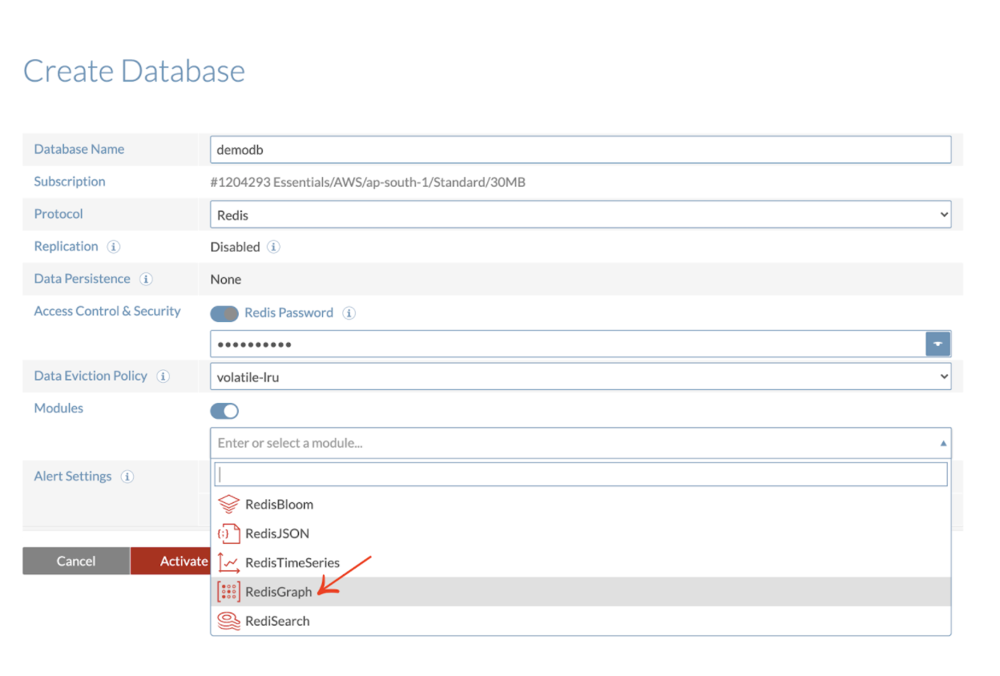
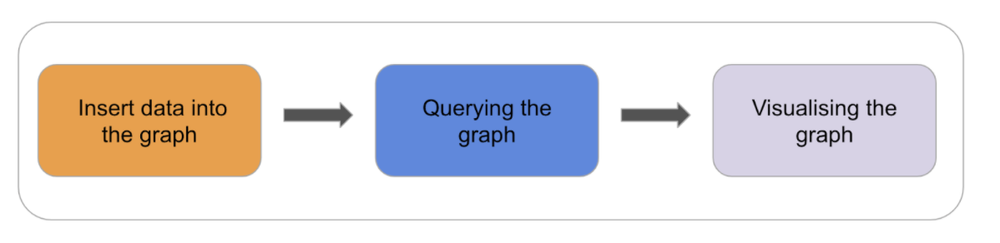
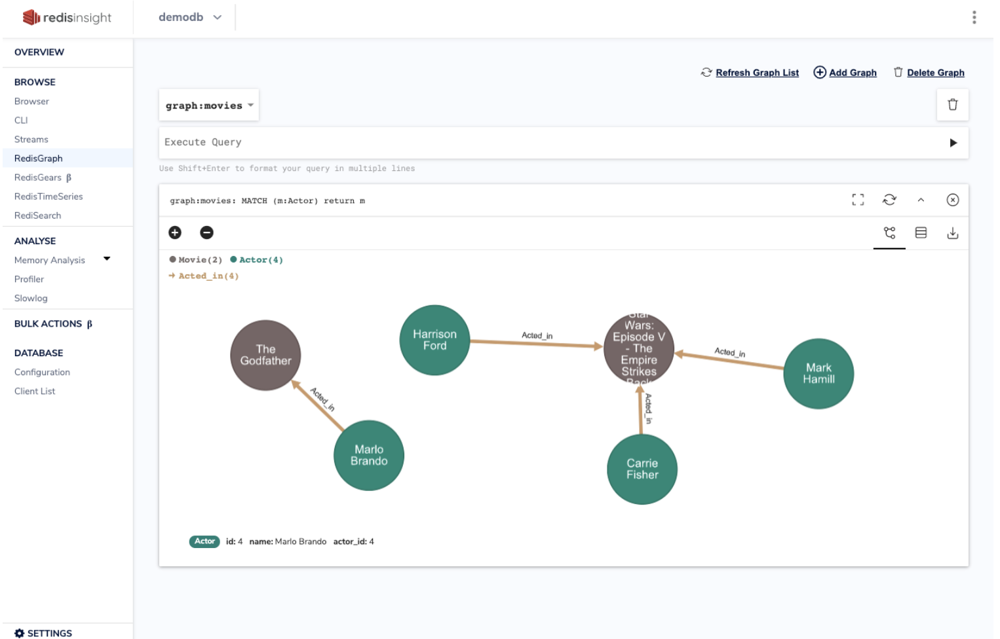

RedisGraph is a Redis module that enables enterprises to process any kind of connected data much faster than with traditional relational or existing graph databases. RedisGraph implements a unique data storage and processing solution (with sparse-adjacency matrices and GraphBLAS) to deliver the fastest and most efficient way to store, manage, and process connected data in graphs. With RedisGraph, you can process complex transactions 10 - 600 times faster than with traditional graph solutions while using 50 - 60% less memory resources than other graph databases!


### Step 1. Register and subscribe

Follow [this link to register](/create/cloud/rediscloud) and subscribe to Redis Enterprise Cloud


### Step 2. Create a database with RedisGraph Module




### Step 3. Connect to a database


Follow [this](explore/redisinsight) link to know how to connect to a database


### Step 4. Getting Started with RedisGraph

In the following steps, we will use some basic RediGraph commands to insert data into a graph and then query the graph. You can run them from the Redis command-line interface (redis-cli) or use the CLI available in RedisInsight. (See part 2 of this tutorial to learn more about using the RedisInsight CLI.)



### Step 5: Insert data into a graph

#### Insert actors

To interact with RedisGraph you will typically use the GRAPH.QUERY command and execute Cypher queries. Let’s start to insert some actors into the graph:movies graph name, which is automatically created using this command:

```
>> GRAPH.QUERY graph:movies "CREATE (:Actor {name:'Mark Hamill', actor_id:1}), (:Actor {name:'Harrison Ford', actor_id:2}), (:Actor {name:'Carrie Fisher', actor_id:3})"

1) 1) "Labels added: 1"
   2) "Nodes created: 3"
   3) "Properties set: 6"
   4) "Query internal execution time: 0.675400 milliseconds"
```
This single query creates three actors, along with their names and unique IDs.

#### Insert a movie

```
> GRAPH.QUERY graph:movies "CREATE (:Movie {title:'Star Wars: Episode V - The Empire Strikes Back', release_year: 1980 , movie_id:1})"
1) 1) "Labels added: 1"
   2) "Nodes created: 1"
   3) "Properties set: 3"
   4) "Query internal execution time: 0.392300 milliseconds"
```

This single query creates a movie with a title, the release year, and an ID.

#### Associate actors and movies

The core of a graph is the relationships between the nodes, allowing the applications to navigate and query them. Let’s create a relationship between the actors and the movies:

```
> GRAPH.QUERY graph:movies "MATCH (a:Actor),(m:Movie) WHERE a.actor_id = 1 AND m.movie_id = 1 CREATE (a)-[r:Acted_in {role:'Luke Skywalker'}]->(m) RETURN r"
1) 1) "r"
2) 1) 1) 1) 1) "id"
            2) (integer) 1
         2) 1) "type"
            2) "Acted_in"
         3) 1) "src_node"
            2) (integer) 0
         4) 1) "dest_node"
            2) (integer) 3
         5) 1) "properties"
            2) 1) 1) "role"
                  2) "Luke Skywalker"
3) 1) "Properties set: 1"
   2) "Relationships created: 1"
   3) "Query internal execution time: 0.664800 milliseconds"
```

This command created a new relation indicating that the actor Mark Hamill acted in Star Wars: Episode V  as Luke Skywalker.

Let’s repeat this process for the other actors:

```
> GRAPH.QUERY graph:movies "MATCH (a:Actor), (m:Movie) WHERE a.actor_id = 2 AND m.movie_id = 1 CREATE (a)-[r:Acted_in {role:'Han Solo'}]->(m) RETURN r"
> GRAPH.QUERY graph:movies "MATCH (a:Actor), (m:Movie) WHERE a.actor_id = 3 AND m.movie_id = 1 CREATE (a)-[r:Acted_in {role:'Princess Leila'}]->(m) RETURN r"
```

You can also do all of this in a single query, for example:

```
> GRAPH.QUERY graph:movies "CREATE (:Actor {name:'Marlo Brando', actor_id:4})-[:Acted_in {role:'Don Vito Corleone'}]->(:Movie {title:'The Godfather', release_year: 1972 , movie_id:2})"

1) 1) "Nodes created: 2"
   2) "Properties set: 6"
   3) "Relationships created: 1"
   4) "Query internal execution time: 0.848500 milliseconds"
```


####  Querying the graph

Now that you have data in your graph, you’re ready to ask some questions, such as:

#### “What are the titles of all the movies?”

```
> GRAPH.QUERY graph:movies "MATCH (m:Movie) RETURN m.title"

1) 1) "m.title"
2) 1) 1) "Star Wars: Episode V - The Empire Strikes Back"
   2) 1) "The Godfather"
3) 1) "Query internal execution time: 0.349400 milliseconds"
```


#### “What is the information for the movie with the ID of  1?”

```
> GRAPH.QUERY graph:movies "MATCH (m:Movie) WHERE m.movie_id = 1 RETURN m"

1) 1) "m"
2) 1) 1) 1) 1) "id"
            2) (integer) 3
         2) 1) "labels"
            2) 1) "Movie"
         3) 1) "properties"
            2) 1) 1) "title"
                  2) "Star Wars: Episode V - The Empire Strikes Back"
               2) 1) "release_year"
                  2) (integer) 1980
               3) 1) "movie_id"
                  2) (integer) 1
3) 1) "Query internal execution time: 0.365800 milliseconds"
```

#### “Who are the actors in the movie 'Star Wars: Episode V - The Empire Strikes Back' and what roles did they play?”

```
> GRAPH.QUERY graph:movies "MATCH (a:Actor)-[r:Acted_in]-(m:Movie) WHERE m.movie_id = 1 RETURN a.name,m.title,r.role"
1) 1) "a.name"
   2) "m.title"
   3) "r.role"
2) 1) 1) "Mark Hamill"
      2) "Star Wars: Episode V - The Empire Strikes Back"
      3) "Luke Skywalker"
   2) 1) "Harrison Ford"
      2) "Star Wars: Episode V - The Empire Strikes Back"
      3) "Han Solo"
   3) 1) "Carrie Fisher"
      2) "Star Wars: Episode V - The Empire Strikes Back"
      3) "Princess Leila"
3) 1) "Query internal execution time: 0.641200 milliseconds"
```

#### Visualizing graph databases with RedisInsight

If you are using RedisInsight, you can visualize and navigate into the nodes and relationships graphically.
Click on the RedisGraph menu entry on the left and enter the query:

```
MATCH (m:Actor) return m
```

Click on the Execute button, and double click on the actors to follow the relationships You should see a graph like this one:




### Next Steps 

- Learn more about RedisGraph in the [Quickstart](https://oss.redis.com/redisgraph/) tutorial.

