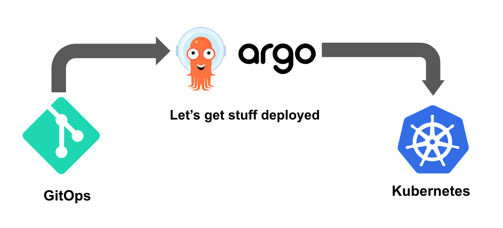
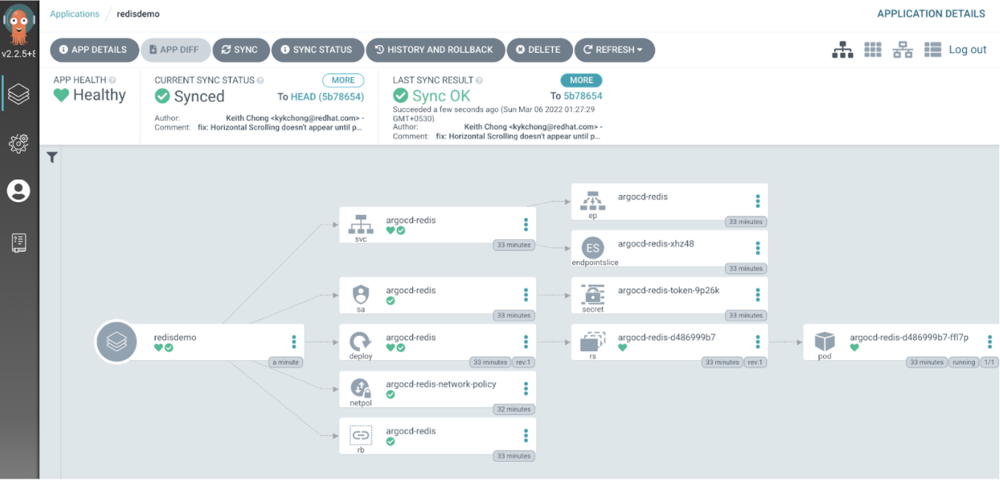
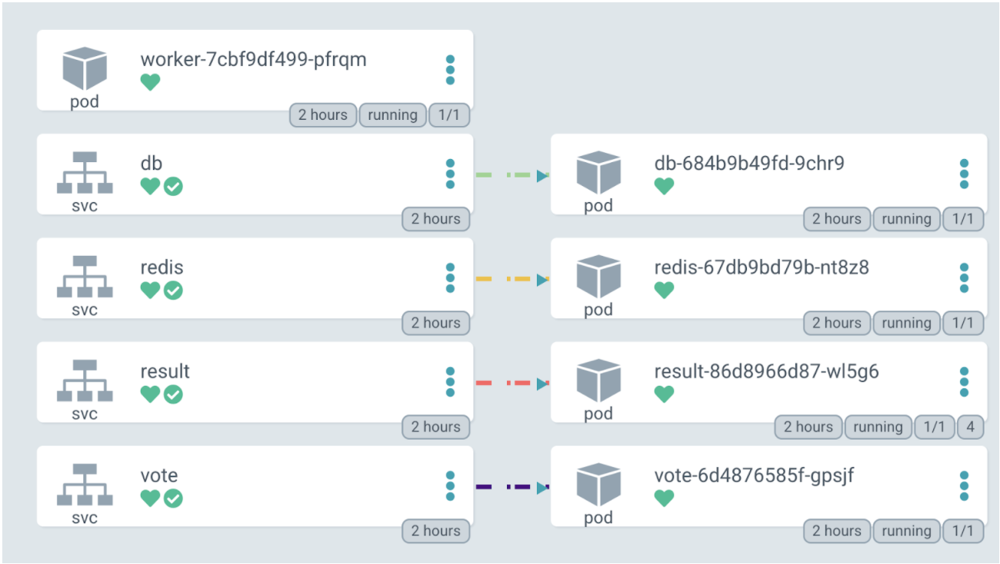
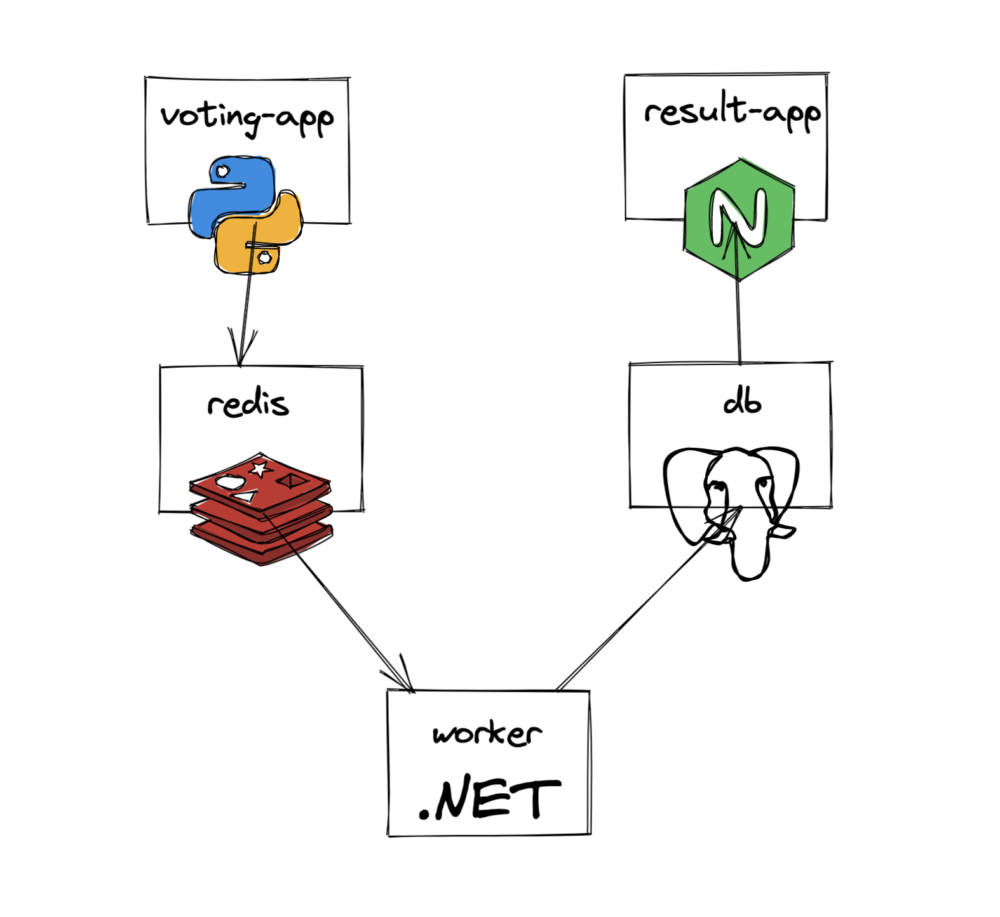
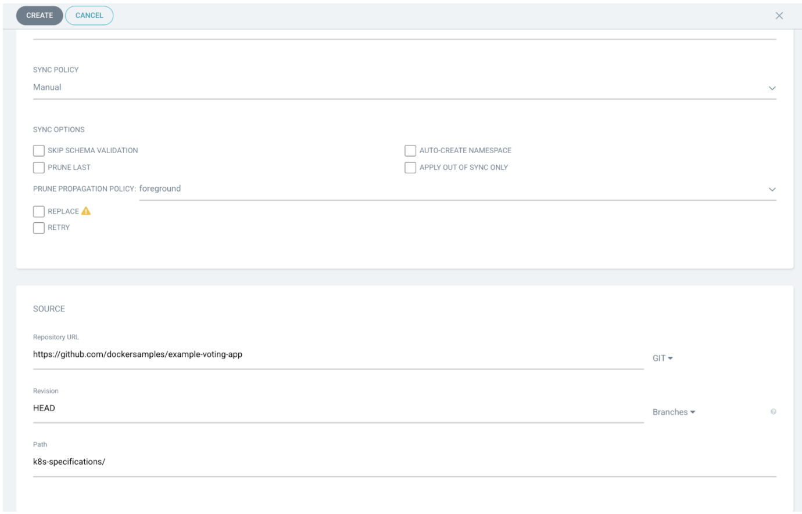
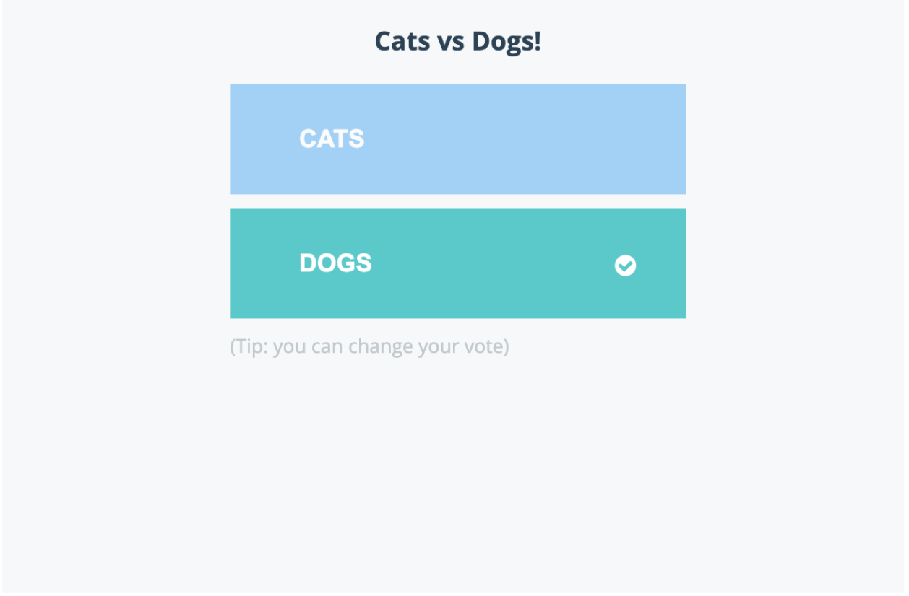
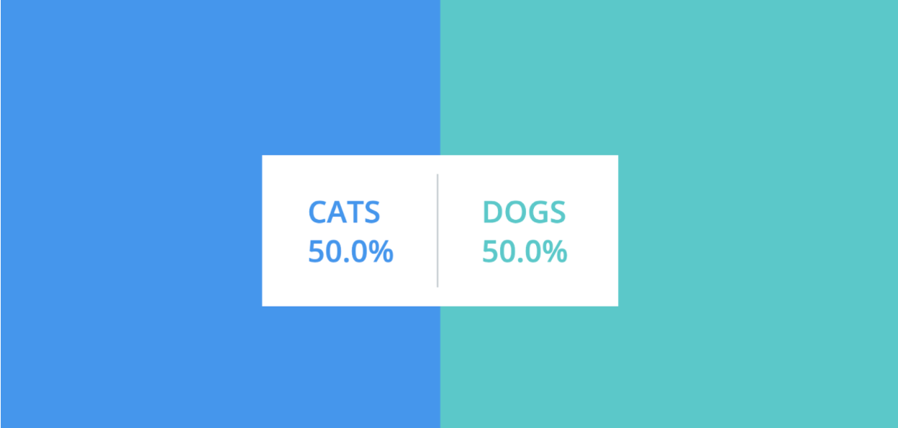

## What is an Argo CD? 

Argo CD is a combination of the two terms “Argo” and “CD,” [Argo](https://argoproj.github.io/) being an open source container-native workflow engine for Kubernetes. It is a [CNCF-hosted project](https://www.cncf.io/blog/2020/04/07/toc-welcomes-argo-into-the-cncf-incubator/) that provides an easy way to combine all three modes of computing—services, workflows, and event-based—all of which are very useful for creating jobs and applications on Kubernetes. It is an engine that makes it easy to specify, schedule, and coordinate the running of complex workflows and applications on Kubernetes. The CD in the name refers to [continuous delivery](https://en.wikipedia.org/wiki/Continuous_delivery), which is an extension of continuous integration (CI) since it automatically deploys all code changes to a testing and/or production environment after the build stage. 



Argo CD follows [GitOps methodology](https://about.gitlab.com/topics/gitops/). GitOps is a CD methodology centered around using [Git as a single source of truth](https://git-scm.com/) for declarative infrastructure and application code. It watches a remote Git repository for new or updated manifest files and synchronizes those changes with the cluster. By managing manifests in Git and syncing them with the cluster, you get all the advantages of a Git-based workflow (version control, pull-request reviews, transparency in collaboration, etc.) and a one-to-one mapping between what is in the Git repo and what is deployed in the cluster.

Argo CD empowers organizations to declaratively build and run cloud native applications and workflows on Kubernetes using GitOps. It is a pull-based, declarative, GitOps continuous delivery tool for Kubernetes with a[ fully loaded UI](https://github.com/argoproj/argo-cd/tree/master/ui). The tool reads your environment configuration from your Git repository and applies it to your Kubernetes namespaces. App definitions, environment, and configurations should be declarative and version controlled. App deployment and life cycle management should be automated, audible, and easy to understand.

Built specifically to make the continuous deployment process to a Kubernetes cluster simpler and more efficient, Argo CD solves multiple challenges, such as the need to set up and install additional tools outside of Jenkins for a complete CI/CD process to Kubernetes, the need to configure access control to Kubernetes in and out (including cloud platforms), the need to have visibility of deployment status once a new app gets pushed to a Kubernetes cluster, and more. 

Please note that Argo CD isn’t just deployed inside of Kubernetes but should be looked at as an extension of Kubernetes as it uses existing Kubernetes resources and functionalities like etcd and controllers to store data and monitor real-time updates of application state.  


## How does Argo CD work? 


It solves the problems above in the CD process by being a more integral part of the Kubernetes cluster. Instead of pushing changes to the Kubernetes cluster, Argo CD pulls Kubernetes manifest changes and applies them to the cluster. Once you set up Argo CD inside of your Kubernetes cluster, you configure Argo CD to connect and track your Git repo changes. 

If any changes are detected, then Argo CD applies those changes automatically to the cluster. Now developers can commit code (for example, Jenkins), which will automatically build a new image, push it to the docker repo, and then finally update the Kubernetes manifest file that will be automatically pulled by Argo CD, ultimately saving manual work, reducing the initial setup configuration, and eliminating security risks. But what about DevOps teams making other changes to the application configuration? Whatever manifest files connected to the Git repo will be tracked and synced by Argo CD and pulled into the Kubernetes cluster, providing a single flexible deployment tool for developers and DevOps. 

Argo CD watches the changes in the cluster as well, which becomes important if someone updates the cluster manually. Argo CD will detect the divergence of states between the cluster and Git repo. Argo CD compares desired configuration in the Git repo with the actual state in the Kubernetes cluster and syncs what is defined in the Git repo to the cluster, overriding whatever update was done manually—guaranteeing that the Git repo remains the single source of truth. But, of course, Argo CD is flexible enough to be configured to not automatically override manual updates if a quick update needs to happen directly to the cluster and an alert be sent instead.


## **What are Argo CD’s capabilities?**

- Argo CD is a very simple and efficient way to have declarative and version-controlled application deployments with its automatic monitoring and pulling of manifest changes in the Git repo, but it also has easy rollback and reverts to the previous state, not manually reverting every update in the cluster.

- It also provides automation and traceability via GitOps workflow with a web UI for visualizing Kubernetes resources.

- Argo CD defines Kubernetes manifests in different ways: it supports Kubernetes YAML files, Helm Charts, Kustomize, and other template files that generate Kubernetes manifests. 

- Argo CD also has a command-line interface application, a Grafana metrics dashboard, and audit trails for application events and API calls.

- Argo CD has a very simple cluster disaster recovery process whereby pointing a new cluster to the Git repo if a cluster has gone down will automatically recreate the same exact state without any intervention because of its declarative nature.

- Kubernetes cluster access control with Git and Argo CD is simple—you can configure who can commit merge requests and who can actually approve those merge requests, providing a clean way to manage cluster access indirectly via Git. There is also no need to give external access to other tools like Jenkins, keeping cluster credentials safe because Argo CD is already running in the cluster and is the only tool that actually applies changes. 


## Prerequisites:


* Install Docker Desktop
* Enable Kubernetes
* Install Argo CD

## Getting Started


### Step 1. Install Argo CD


```
brew install argocd
```


### Step 2. Create a new namespace

Create a namespace argocd where all Argo CD resources will be installed.


```
kubectl create namespace argocd
```


### Step 3. Install Argo CD resources


```
kubectl apply -n argocd -f https://raw.githubusercontent.com/argoproj/argo-cd/stable/manifests/install.yaml

kubectl get po -n argocd
NAME                                  READY   STATUS              RESTARTS   AGE
argocd-application-controller-0       0/1     ContainerCreating   0          3m9s
argocd-dex-server-65bf5f4fc7-5kjg6    0/1     Init:0/1            0          3m13s
argocd-redis-d486999b7-929q9          0/1     ContainerCreating   0          3m13s
argocd-repo-server-8465d84869-rpr9n   0/1     Init:0/1            0          3m12s
argocd-server-87b47d787-gxwlb         0/1     ContainerCreating   0          3m11s
```


### Step 4. Ensure that all Pods are up and running


```
kubectl get po -n argocd
NAME                                  READY   STATUS    RESTARTS   AGE
argocd-application-controller-0       1/1     Running   0          5m25s
argocd-dex-server-65bf5f4fc7-5kjg6    1/1     Running   0          5m29s
argocd-redis-d486999b7-929q9          1/1     Running   0          5m29s
argocd-repo-server-8465d84869-rpr9n   1/1     Running   0          5m28s
argocd-server-87b47d787-gxwlb         1/1     Running   0          5m27s
```


### Step 5. Configure Port Forwarding for Dashboard Access


```
kubectl port-forward svc/argocd-server -n argocd 8080:443
Forwarding from 127.0.0.1:8080 -> 8080
Forwarding from [::1]:8080 -> 8080
```


### Step 6. Log in


```
kubectl -n argocd get secret argocd-initial-admin-secret -o jsonpath="{.data.password}" | base64 -d; echo

HcD1I0XXXXXQVrq-
```


### Step 7. Install Argo CD CLI on Mac using Homebrew


```
brew install argocd
```


### Step 8. Access the Argo CD API Server

By default, the Argo CD API server is not exposed with an external IP. To access the API server, choose one of the following techniques to expose the Argo CD API server:


```
kubectl patch svc argocd-server -n argocd -p '{"spec": {"type": "LoadBalancer"}}'
service/argocd-server patched
```


### Step 9. Log in to Argo CD


```
argocd login localhost      
WARNING: server certificate had error: x509: certificate signed by unknown authority. Proceed insecurely (y/n)? y
Username: admin
Password: 
'admin:login' logged in successfully
Context 'localhost' updated
```


### Step 10. Update the password


```
% argocd account update-password
*** Enter password of currently logged in user (admin):                       
*** Enter new password for user admin: 
*** Confirm new password for user admin: 
Password updated
Context 'localhost' updated
ajeetraina@Ajeets-MacBook-Pro ~ % 
```


### Step 11. Register a Cluster to Deploy Apps to

As we are running it on Docker Desktop, we will add it accordingly.


```
argocd cluster add docker-desktop
WARNING: This will create a service account `argocd-manager` on the cluster referenced by context `docker-desktop` with full cluster level admin privileges. Do you want to continue [y/N]? y
INFO[0002] ServiceAccount "argocd-manager" created in namespace "kube-system" 
INFO[0002] ClusterRole "argocd-manager-role" created    
INFO[0002] ClusterRoleBinding "argocd-manager-role-binding" created 
Cluster 'https://kubernetes.docker.internal:6443' added
```


### Step 12. Create a New Redis application

Click “Create” and provide a repository URL as [https://github.com/argoproj/argo-cd/tree/master/manifests/base/redis](https://github.com/argoproj/argo-cd/tree/master/manifests/base/redis) 


```
argocd app list     
NAME       CLUSTER                                  NAMESPACE  PROJECT  STATUS  HEALTH   SYNCPOLICY  CONDITIONS  REPO                                 PATH                  TARGET
redisdemo  https://kubernetes.docker.internal:6443  argocd     default  Synced  Healthy  <none>      <none>      https://github.com/argoproj/argo-cd  manifests/base/redis  HEAD


```




 





### Step 13. Delete the Redis app


```
argocd app delete redisdemo
```


#### Example: Voting App 


Let’s try to deploy a voting app. The voting application only accepts one vote per client. It does not register votes if a vote has already been submitted from a client.




* A Python web app which lets you vote between two options
* A Redis queue which collects new votes
* A .NET worker which consumes votes and stores them in …
* A Postgres database backed by a Docker volume
* A Node.js web app which shows the results of the voting in real time

Go to the Argo CD dashboard, enter the [repository URL](https://github.com/dockersamples/example-voting-app/tree/master/k8s-specifications), and supply the right PATH. Click “Create App” to deploy the application on your Docker Desktop.





Next, visualize the complete application by choosing “Group by Node.”


### Step 14. Grouping by Parent Resources


Keep a close watch over the events by clicking on “Events” section.


Below is the complete overview of the voting application.


Access the app via [http://localhost:31000/](http://localhost:31000/) 




The results are accessible via [http://localhost:31001/](http://localhost:31001/) 




### Additional References:


- [https://argo-cd.readthedocs.io/en/stable/](https://argo-cd.readthedocs.io/en/stable/)
- [https://github.com/argoproj/argo-cd](https://github.com/argoproj/argo-cd)
- [https://blog.argoproj.io/doing-gitops-at-scale-6313f5889775](https://blog.argoproj.io/doing-gitops-at-scale-6313f5889775)
