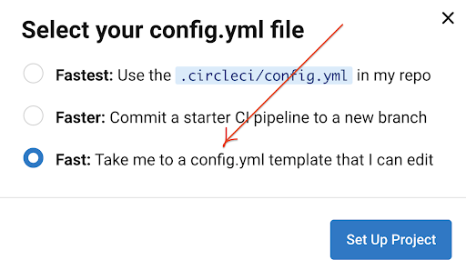
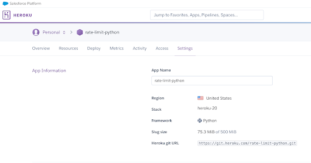
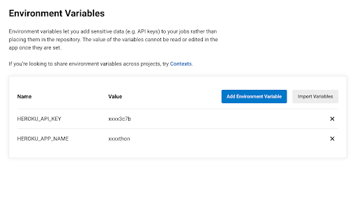

# **CircleCI: What It Is and Why It Should Be Part of Your Redis CI/CD**


## **What is CircleCI?**


CircleCI is a CI/CD platform built by DevOps professionals to help you fine-tune your entire development process from start to finish. It helps engineering teams build, test, and deploy software while checking code changes in real time with the CircleCI dashboard UI. More control over pipelines is possible with the ability to build in the CI/CD process per project or configure workflows to decide on when and how jobs run, plus data- and image-caching options that optimize continuous delivery. 

CircleCI supports many different languages and a varied amount of cloud-hosted compute types such as Docker, Linux VMs, macOS, Windows, and more for a simplified approach to infrastructure. With the CircleCI dashboard, it's possible to gather insights on build changes to continuously optimize pipelines. 

To deploy, CircleCI takes artifacts from your pipeline and sends them to wherever you need them deployed, whether it's Docker, Heroku, Kubernetes, cloud platforms, and more.


## **How does CircleCI work?**


After GitHub or Bitbucket are authorized and added as a project to cirlceci.com, every code change triggers CircleCI jobs. CircleCI sends an email notification of success or failure after the test completes. CircleCI finds and runs config.yml, tests the build, runs security scans, goes through approval steps, and then deploys.


## **What are CircleCI’s capabilities?**

As a DevOps engineer or developer, you can:


* SSH into any job to debug build issues.
* Set up jobs to run in parallel to reduce time.
* Configure a Redis cache with two simple keys to reuse data from previous jobs in your workflow.
* Configure self-hosted runners for unique platform support.
* Access Arm resources for the machine executor. 
* Use reusable packages of configuration to integrate with third parties.
* Use a pre-built Redis Docker image in a variety of languages. 
* Use the API to retrieve information about jobs and workflows.
* Use the CLI to access advanced tools locally. 
* Get flaky test detection with test insights. 


## **Deploy Redis Rate Limiting application on Heroku using CircleCI**


## **Prerequisites:**


* A CircleCI account
* A GitHub account
* A Heroku account


## **Getting started**

In this demo, we will be using the Redis Rate Limiting app built using Python and Redis. 

Rate limiting is a mechanism that many developers may have to deal with at some point in their life. It’s useful for a variety of purposes, such as sharing access to limited resources or limiting the number of requests made to an API endpoint and responding with a 429 status code. The complete source code of the project is [hosted over GitHub](https://github.com/redis-developer/basic-rate-limiting-demo-python). In this example, we will configure CircleCI to deploy the Rate Limiting app directly on the Heroku platform.


## Step 1. Go to [https://circleci.com](https://circleci.com) and log in using your GitHub account


Choose your preferred login method. To make it easier, let us choose “GitHub” for this demonstration.


## Step 2. Verify your permission on GitHub


## Step 3. Select your project repository and click “Setup Project”

We will be using the Redis rate-limiting project for this demonstration.


## Step 4. Create a new CircleCI configuration file

CircleCI believes in _configuration as code_. As a result, the entire delivery process from build to deploy is orchestrated through a single file called config.yml. The config.yml file is located in a folder called .circleci at the top of your project. CircleCI uses the YAML syntax for config.


As we haven’t yet created a config.yml file, let’s choose the “Fast” option to create a new config.yml based on the available template that is editable.





Once you click “Set Up project,” it will ask you to select sample configs as shown in the following screenshot:


Add the following content under .circleci/config.yml and save the file:


```
version: 2.1
orbs:
  heroku: circleci/heroku@1.2.6
workflows:
  heroku_deploy:
    jobs:
      - heroku/deploy-via-git
      
     


```


In the configuration above, we pull in the Heroku orb circleci/heroku@1.2.6, which automatically gives us access to a powerful set of Heroku jobs and commands.

One of those jobs is the heroku/deploy-via-git, which deploys your application straight from your GitHub repo to your Heroku account.


## Step 5. Merge the pull request

Once you make the new change, it will ask you to raise a new PR. Go ahead and merge the changes as of now.


## Step 6. Set up Heroku account


## [Follow these steps ](https://developer.redis.com/create/heroku/portal)to set up a Heroku account and create a new app `rate-limit-python`. You will need the Heroku API key for this demo.


## 





## Configuring Heroku access on CircleCI


## Before you push your project to Heroku from CircleCI, you will need to configure an authenticated handshake between CircleCI and Heroku. Configure the handshake by creating two [environment variables](https://circleci.com/docs/2.0/env-vars/) in the settings for your CircleCI project:


* HEROKU_APP_NAME is the name of your Heroku application (in this case, simple-node-api-circleci)
* HEROKU_API_KEY is your Heroku account API key. This can be found under the Account tab of your Heroku account under Account Settings. Scroll to the API Key section and click **Reveal** to copy your API key.


## Step 7. Set up the environment variables on CircleCI

On the sidebar menu of the settings page, click **Environment Variables** under Build Settings. On the environment variables page, create two variables named `HEROKU_APP_NAME` and `HEROKU_API_KEY` and enter the values for them.

With these in place, our CircleCI configuration will be able to make authenticated deployments to the Heroku platform.





## Step 8. Trigger the build

As soon as you merge the pull request, the tool will trigger the build automatically.


By now, you should be able to access your application. 


```
remote:        Collecting attrs>=19.2.0        
remote:          Downloading attrs-21.4.0-py2.py3-none-any.whl (60 kB)        
remote:        Collecting wrapt<2,>=1.10        
remote:          Downloading wrapt-1.14.0-cp310-cp310-manylinux_2_5_x86_64.manylinux1_x86_64.manylinux_2_17_x86_64.manylinux2014_x86_64.whl (77 kB)        
remote:        Collecting pyparsing!=3.0.5,>=2.0.2        
remote:          Downloading pyparsing-3.0.7-py3-none-any.whl (98 kB)        
remote:        Installing collected packages: wrapt, pyparsing, typing-extensions, sqlparse, packaging, deprecated, async-timeout, asgiref, tomli, redis, py, pluggy, iniconfig, h11, Django, click, attrs, uvloop, uvicorn, urllib3, sniffio, rfc3986, pytz, python-dotenv, pytest, django-redis, django-ipware, django-cors-headers        
remote:        Successfully installed Django-4.0.3 asgiref-3.5.0 async-timeout-4.0.2 attrs-21.4.0 click-8.1.0 deprecated-1.2.13 django-cors-headers-3.11.0 django-ipware-4.0.2 django-redis-5.2.0 h11-0.13.0 iniconfig-1.1.1 packaging-21.3 pluggy-1.0.0 py-1.11.0 pyparsing-3.0.7 pytest-7.1.1 python-dotenv-0.20.0 pytz-2022.1 redis-4.2.0 rfc3986-2.0.0 sniffio-1.2.0 sqlparse-0.4.2 tomli-2.0.1 typing-extensions-4.1.1 urllib3-1.26.9 uvicorn-0.17.6 uvloop-0.16.0 wrapt-1.14.0        
remote: -----> $ python server/manage.py collectstatic --noinput        
remote:        133 static files copied to '/tmp/build_3850bcfb/server/static_root'.        
remote: 
remote: -----> Discovering process types        
remote:        Procfile declares types -> web        
remote: 
remote: -----> Compressing...        
remote:        Done: 75.3M        
remote: -----> Launching...        
remote:        Released v11        
remote:        https://*****************.herokuapp.com/ deployed to Heroku 

```


## Additional references:


* [https://circleci.com/blog/what-is-a-CI/CD-pipeline/](https://circleci.com/blog/what-is-a-ci-cd-pipeline/)
* [https://circleci.com/docs/2.0/getting-started/](https://circleci.com/docs/2.0/getting-started/)
* [https://developer.redis.com/create/heroku/portal](https://developer.redis.com/create/heroku/portal) 