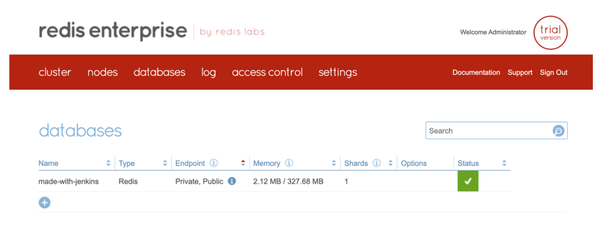

[Jenkins](https://www.jenkins.io/) is currently [the most popular CI tool](https://cd.foundation/announcement/2019/08/14/jenkins-celebrates-15-years/), with ~15M users. It is an open source automation server which enables developers to reliably build, test, and deploy their software. It was forked in 2011 from a project called Hudson after a [dispute with Oracle](https://www.infoq.com/news/2011/01/jenkins/), and is used for [Continuous Integration and Continuous Delivery (CI/CD)](https://stackoverflow.com/questions/28608015/continuous-integration-vs-continuous-delivery-vs-continuous-deployment) and test automation. Jenkins is based on Java and provides over [1700 plugins](https://plugins.jenkins.io/) to automate your developer workflow and save a lot of your time in executing your repetitive tasks.


[Source:](https://www.datanyze.com/market-share/ci--319) Datanyze market analysis

[Jenkins Pipeline](https://www.jenkins.io/solutions/pipeline/) performs Continuous Delivery tasks declared in a `Jenkinsfile` stored alongside your project's code. The [Pipeline plugin](https://plugins.jenkins.io/workflow-aggregator) has a fairly comprehensive [tutorial](https://github.com/jenkinsci/pipeline-plugin/blob/master/TUTORIAL.md) checked into its source tree. Using Pipeline, you can configure Jenkins to automatically deploy key pieces of infrastructure, such as a Redis database.


### Architecture

Jenkins Pipelines are the Continuous Delivery (CD) side of Jenkins. They use a `Jenkinsfile` declarative script to define the behavior of the pipeline. You can script actions in Groovy and run shell scripts from it, so you can make it do pretty much anything.

The `Jenkinsfile` instructs Jenkins to export some environment variables from the Credentials store in order to connect to the Redis server, then executes the Python pipeline script with the Deployment Configuration file given as a parameter. An example `deployment-configuration-file.json` looks like:


```
{
  "database": {
    "name": "made-with-jenkins",
    "port": 12345,
    "size": "S",
    "operation": "CREATE"
  }
}
```


The Python script uses predefined JSON template files that create Redis databases of fixed t-shirt sizes (S, M, L, XL). The Deployment Config file tells the Python script what the desired database name, port, and size are. A sample template file looks like:


```
{
    "name": "{NAME}",
    "type": "redis",
    "memory_size": 343597383
}
```


The following is an architectural diagram of how a Jenkins pipeline adds a database to a Redis cluster.


### Process


1. The Jenkins pipeline clones a remote git repository, containing the application code and the pipeline code.
2. The Redis host, port, user, and password are decrypted from the credentials store and are exported as environment variables.
3. Jenkins runs the Python pipeline script, specifying the deployment configuration file in the git repo.
4. The Python script uses the deployment configuration file to choose and customize a pre-populated template to use as the body of the REST create database request to Redis.


### List of Pipeline Code Files


- [jenkins-re-pipeline.py](https://github.com/masyukun/redis-jenkins-pipeline/blob/main/jenkins-re-pipeline.py)
    * The Python script that creates a Redis database through the Redis REST API.
- [deployment-configuration-file.json](https://github.com/masyukun/redis-jenkins-pipeline/blob/main/deployment-configuration-file.json)
    * The user-specified configuration file for creating a database.
- [redis-standard-size-s.json.template](https://github.com/masyukun/redis-jenkins-pipeline/blob/main/redis-standard-size-s.json.template)
- [redis-standard-size-xl.json.template](https://github.com/masyukun/redis-jenkins-pipeline/blob/main/redis-standard-size-xl.json.template)


##  Configuring Jenkins


### Installing Jenkins

You can use [Docker Desktop](https://www.docker.com/products/docker-desktop) to quickly get a Jenkins instance up and running, exposing ports 8080 (web GUI) and 50000 (inbound agents).


```
docker run --name jenk -p 8080:8080 -p 50000:50000 jenkins/jenkins:lts-jdk11
```


The installation will generate a first-run password in the docker-cli output.


Then open[ http://localhost:8080/](http://localhost:8080/) and enter the password to unlock your instance and begin installation.


Choose "Install suggested plugins"


Wait for the plugins to complete the installation process.


Next, you’re prompted to create your admin user.


Congratulations! Jenkins is ready!


### Installing Python and custom libraries

If you use an existing instance of Jenkins, you can install Python and the custom libraries from the command line interface of that machine.

Docker instances of Jenkins can be accessed by shell using the following command:


```
docker exec -it -u root jenk bash
```


The Python pipeline script requires the libraries `click` and `requests`. It also requires Python.


```
apt-get update
apt-get install -y python3-pip

pip install --upgrade pip
pip install click
pip install requests
```


Alternatively, if you are creating a new Jenkins from scratch, you can include these dependencies in a separate `Dockerfile` that builds off the base Jenkins image:


```
FROM jenkins:latest
USER root
RUN apt-get update
RUN apt-get install -y python-pip

# Install app dependencies
RUN pip install --upgrade pip
RUN pip3 install click
RUN pip3 install requests
```


### Add credentials to Secret Store

Using the left-side menu, select **Manage Jenkins**, then select **Manage Credentials**, then click the link **(global)**.


From here, you can specify Kind: **Secret text** for the 4 secrets required to connect with the Redis REST endpoint:


- `REDIS_SERVER_FQDN`
    * Set to the 'https://server-address' of the target Redis instance.
- `REDIS_SERVER_PORT`
    * Set to the Redis REST API port (default 9443).
- `REDIS_USER`
    * Set to the Redis admin user allowed to create databases.
- REDIS_PASS
    * Set to the Redis admin user's password.


If you are using a private code repository, you may also wish to include a Personal Access Token here.


### Create the Jenkins pipeline

From the dashboard, click **New Item**.


Enter in a name for the pipeline, and choose the **Pipeline** type.


## Connect GitHub repository

From the Pipeline configuration page that appears, check the **GitHub** box and enter the git clone URL, complete with any credentials needed to read the repository. For GitHub access, the password should be a Personal Access Token rather than the actual user password.


### Redis pipeline Jenkinsfile

Scrolling down on this page to the **Advanced Project Options**, you can either past in the `Jenkinsfile`, or you can specify the filename if the file exists in the git repository.


Here is an example `Jenkinsfile` containing the mapping of Credentials to the environment variables, and 2 separate stages – a Hello World which always succeeds, and a build stage that invokes the Python script. Paste this into the pipeline script section.


```
pipeline {
    agent any
    
    environment {
        REDIS_SERVER_FQDN = credentials('REDIS_SERVER_FQDN')
        REDIS_SERVER_PORT = credentials('REDIS_SERVER_PORT')
        REDIS_USER =  credentials('REDIS_USER')
        REDIS_PASS = credentials('REDIS_PASS')
    }

    stages {
        stage('Hello') {
            steps {
                echo 'Hello World'
            }
        }
     
        stage('build') {
            steps {
                git branch: 'main', url: 'https://github.com/masyukun/redis-jenkins-pipeline.git'
                sh 'python3 jenkins-re-pipeline.py --deployfile deployment-configuration-file.json'
            }
        }
    }
}
```


Click "Save" when the job spec is complete.


### Run the Jenkins pipeline

Click on the pipeline you created:


Click the "Build Now" icon on the left side menu.


Click the **Status** icon on the left side menu in order to see the results of all the output from each of the stages of your pipeline.


Hover over the **build** stage and click the **Logs** button of the most recent build in order to see the Python script’s output.


Sample output: you should see a verbose response from Redis’s REST service in the “Shell Script” accordion pane.

There’s also a “Git” output log, in case you need to debug something at that level. Any time you update the branch in the remote git repository, you should see evidence in that log that the latest changes have successfully checked out into the local Jenkins git repository.


Open your Redis Enterprise Secure Management UI at `https://servername:8443` and click on the **databases** menu item to verify that your database was created with the name, port, and size specified in the `deployment-configuration-file.json` file.




Congratulations! You have deployed a Redis Enterprise database using a Jenkins Pipeline!

The GitHub repository is currently: [https://github.com/masyukun/redis-jenkins-pipeline](https://github.com/masyukun/redis-jenkins-pipeline)


### Further Reading


- [How to Embed Redis into Your CI-CD Process](https://redis.com/blog/how-to-embed-redis-into-your-continuous-integration-and-continuous-deployment-ci-cd-process/)
- [Top Redis Headaches for DevOps](https://redis.com/blog/top-redis-headaches-for-devops-replication-timeouts/)
- [Top 5 Reasons why DevOps Love Redis Enterprise ](https://redis.com/blog/why-devops-teams-love-redis-enterprise/)
