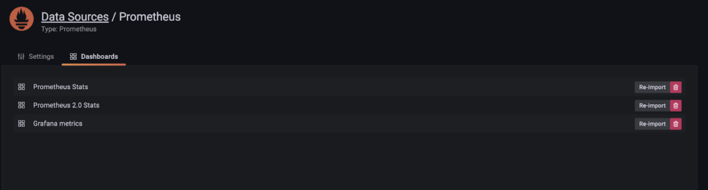
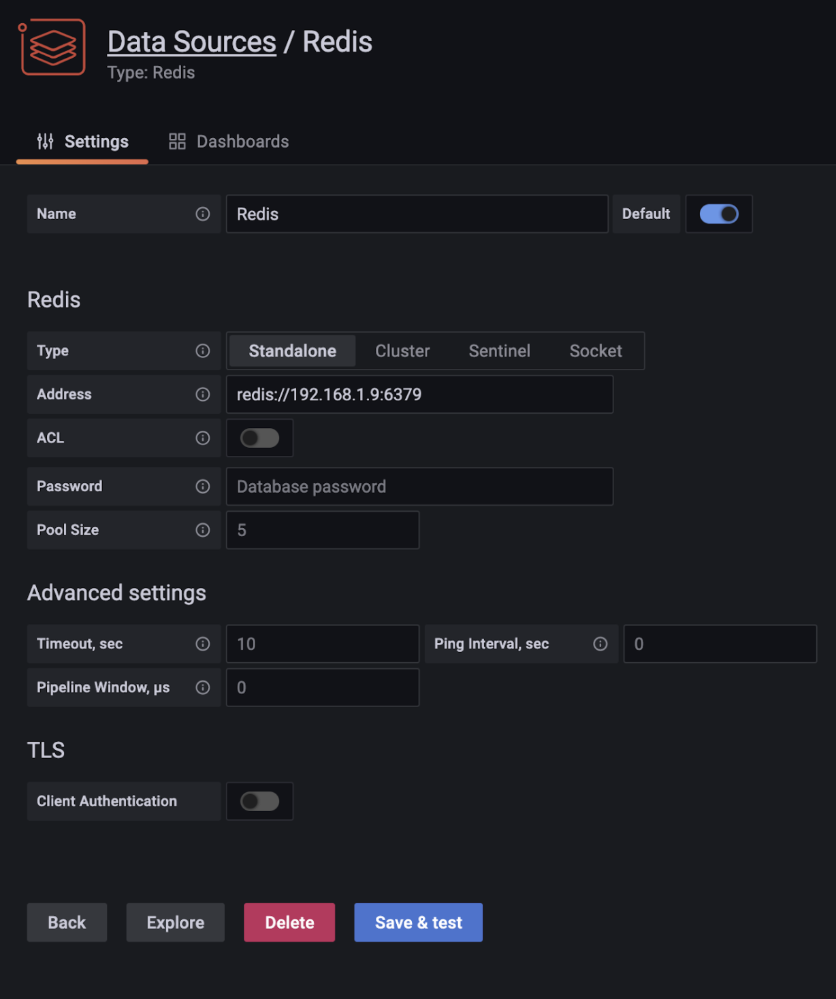

Time-series data is basically a series of data stored in time order and produced continuously over a long period of time. These measurements and events are tracked, monitored, downsampled, and aggregated over time. The events could be, for example, IoT sensor data. Every sensor is a source of time-series data. Each data point in the series stores the source information and other sensor measurements as labels. Data labels from every source may not conform to the same structure or order.

A time-series database is a database system designed to store and retrieve such data for each point in time. Timestamped data can include data generated at regular intervals as well as data generated at unpredictable intervals.


### When do you use a time-series database?

- When your application needs data that accumulates quickly and your other databases aren’t designed to handle that scale.
- For financial or industrial applications.
- When your application needs to perform real-time analysis of billions of records.
- When your application needs to perform online queries at millisecond timescales, and support CPU-efficient ad-hoc queries.


### Challenges with the existing traditional databases

You might find numerous solutions that still store time-series data in a relational database, but they’re quite inefficient and come with their own set of drawbacks. A typical time-series database is usually built to only manage time-series data, hence one of the challenges it faces is with use cases that involve some sort of computation on top of time-series data. One good example could be capturing a live video feed in a time-series database. If you want to run an AI model for face recognition, you would have to extract the time-series data, apply some sort of data transformation and then do computation. 
Relational databases carry the overhead of locking and synchronization that aren’t required for the immutable time-series data. This results in slower-than-required performance for both ingest and queries. When scaling out, it also means investing in additional compute resources. These databases enforce a rigid structure for labels and can’t accommodate unstructured data. They also require scheduled jobs for cleaning up old data. Beyond the time-series use case, these databases are also used for other use cases, which means overuse of running time-series queries may affect other workloads.

### What is RedisTimeSeries?

RedisTimeSeries is a purpose-built time-series database that addresses the needs of handling time-series data. It removes the limitations enforced by relational databases and enables you to collect, manage, and deliver time-series data at scale. As an in-memory database, RedisTimeSeries can ingest over 500,000 records per second on a standard node. Our benchmarks show that you can ingest over 11.5 million records per second with a cluster of 16 Redis shards. 

RedisTimeSeries is resource-efficient. With RedisTimeSeries, you can add rules to compact data by downsampling. For example, if you’ve collected more than one billion data points in a day, you could aggregate the data by every minute in order to downsample it, thereby reducing the dataset size to 1,440 data points (24 * 60 = 1,440). You can also set data retention policies and expire the data by time when you don’t need them anymore. RedisTimeSeries allows you to aggregate data by average, minimum, maximum, sum, count, range, first, and last. You can run over 100,000 aggregation queries per second with sub-millisecond latency. You can also perform reverse lookups on the labels in a specific time range.

### Notables features of RedisTimeseries  includes:


* High volume inserts, low latency reads
* Query by start time and end-time
* Aggregated queries (Min, Max, Avg, Sum, Range, Count, First, Last, STD.P, STD.S, Var.P, Var.S) for any time bucket
* Configurable maximum retention period
* Downsampling/Compaction - automatically updated aggregate time series
* Secondary index - each time series has labels (field value pairs) which will allows to query by labels

### Why Prometheus?

Prometheus is an open-source systems monitoring and alerting toolkit. It collects and stores its metrics as time series data, i.e. metrics information. The metrics are numeric measurements in a time series, meaning changes recorded over time. These metrics are stored with the timestamp at which it was recorded, alongside optional key-value pairs called labels. Metrics play an important role in understanding why your application is working in a certain way.


### Prometheus remote storage adapter for RedisTimeSeries

In the RedisTimeSeries organization you can find projects that help you integrate RedisTimeSeries with other tools, including Prometheus and Grafana. The Prometheus remote storage adapter for RedisTimeSeries is available and the project is hosted [on GitHub here](https://github.com/RedisTimeSeries/prometheus-redistimeseries-adapter.) It’s basically a read/write adapter to use RedisTimeSeries as a backend database. RedisTimeSeries Adapter receives Prometheus metrics via the remote write, and writes to Redis with the RedisTimeSeries module.

## Getting Started

### Prerequisite:


-  Install GIT
-  Install Docker
-  Install Docker Compose

### Step 1. Clone the repository


```
 git clone https://github.com/RedisTimeSeries/prometheus-redistimeseries-adapter
```


### Step 2. Examining the Docker Compose File

This  Docker compose defines 4 services - 

1. Prometheus
2. Adapter
3. Grafana
4. Redis

```yaml
 version: '3'
 services:
   prometheus:
     image: "prom/prometheus:v2.8.0"
     command: ["--config.file=/prometheus.yml"]
     volumes:
       - ./prometheus.yaml:/prometheus.yml
     ports:
       - 9090:9090
  adapter:
    image: "redislabs/prometheus-redistimeseries-adapter:master"
    command: ["-redis-address", "redis:6379", "-web.listen-address", "0.0.0.0:9201"]
  redis:
    image: "redislabs/redistimeseries:edge"
    ports:
      - "6379:6379"
  grafana:
    build: ./grafana/
    ports:
      - "3000:3000"
 ```


#### Prometheus


The `prometheus` service directly uses an image “prom/prometheus” that’s pulled from Docker Hub. It then binds the container and the host machine to the exposed port, 9090. The prometheus configuration file is accessed by mounting the volume on the host and container.


#### Storage Adapter

The `adapter` service uses an image “`redislabs/prometheus-redistimeseries-adapter:master`” that’s pulled from Docker Hub. Sets the default command for the container:  `-redis-address", "redis:6379 and listen to the address 0.0.0.0:9201. `

#### Redis 


The `Redis` service directly uses an image “`redislabs/redistimeseries:edge`” that’s pulled from Docker Hub. It then binds the container and the host machine to the exposed port, `6379`

#### Grafana


The `grafana` service uses an image that’s built from the `Dockerfile` in the current directory. It then binds the container and the host machine to the exposed port, `3000`. 

### Step 3. Run the Docker Compose

Change directory to compose and execute the below CLI:


```bash
 docker-compose up -d
```

```bash
 ajeetraina@Ajeets-MacBook-Pro compose % docker-compose ps
 NAME                   COMMAND                  SERVICE             STATUS              PORTS
 compose-adapter-1      "/adapter/redis-ts-a…"   adapter             running             
 compose-grafana-1      "/run.sh"                grafana             running             0.0.0.0:3000->3000/tcp
 compose-prometheus-1   "/bin/prometheus --c…"   prometheus          running             0.0.0.0:9090->9090/tcp
 compose-redis-1        "docker-entrypoint.s…"   redis               running             0.0.0.0:6379->6379/tcp
```

### Step 4. Accessing the Grafana

Open http://hostIP:3000 to access the Grafana dashboard. The default username and password is admin/admin.

### Step 5. Add Prometheus Data Source

In the left sidebar, you will see the “Configuration” option. Select “Data Source” and choose Prometheus.


Click “Save and Test”.

### Step 6. Importing Prometheus Data Source

Click on “Import” for all the Prometheus dashboards.





### Step 7. Adding Redis Data Source

Again, click on “Data Sources” and add Redis. 





Click "Import".


### Step 8. Running the Sensor Script

It’s time to test drive a few demo scripts built by the Redis team. To start with, clone the below repository


```
 git clone https://github.com/RedisTimeSeries/prometheus-demos
```


This repo contains a set of basic demoes showcasing the integration of RedisTimeSeries with Prometheus and Grafana. Let’s pick up a sensor script.


```
 python3 weather_station/sensors.py
```


This script will add random measurements for temperature and humidity for a number of sensors.

Go to “Add Panel” on the top right corner of the Grafana dashboard and start adding temperature and humidity values. 


### Step 9. Accessing Prometheus Dashboard

Open up [https://HOSTIP:9090](https://HOSTIP:9090) to access Prometheus dashboard for the sensor values without any further configuration.


### Further References:


* [Prometheus remote storage adapter for RedisTimeSeries](https://github.com/RedisTimeSeries/prometheus-redistimeseries-adapter)
* [Remote Storage Integration](https://prometheus.io/docs/prometheus/latest/storage/#remote-storage-integrations)
* [RedisTimeSeries Demos](https://github.com/RedisTimeSeries/prometheus-demos)

##

<div>
<a href="https://launchpad.redis.com" target="_blank" rel="noopener" className="link"> </a>
</div>
