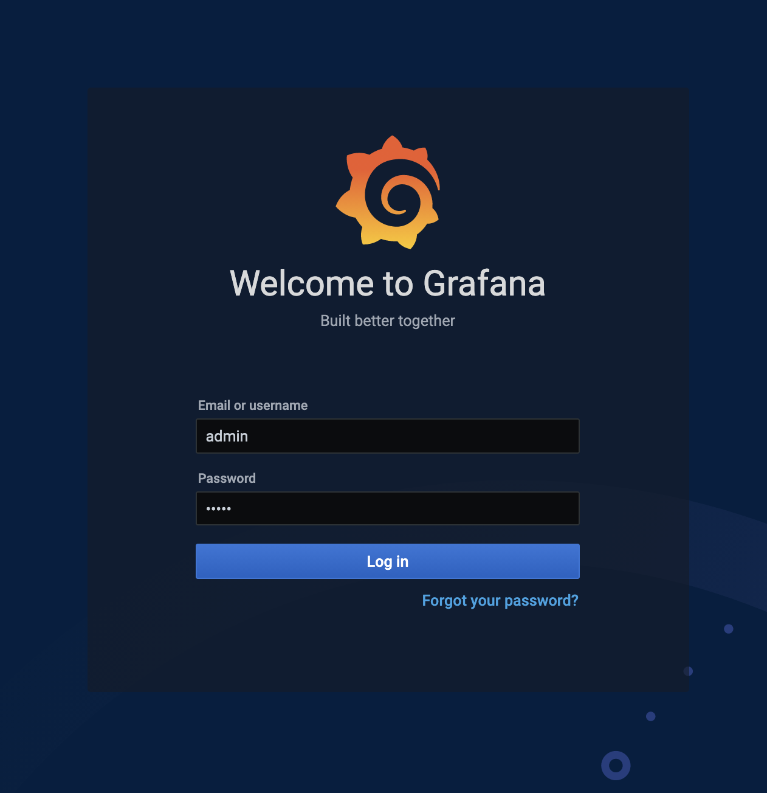
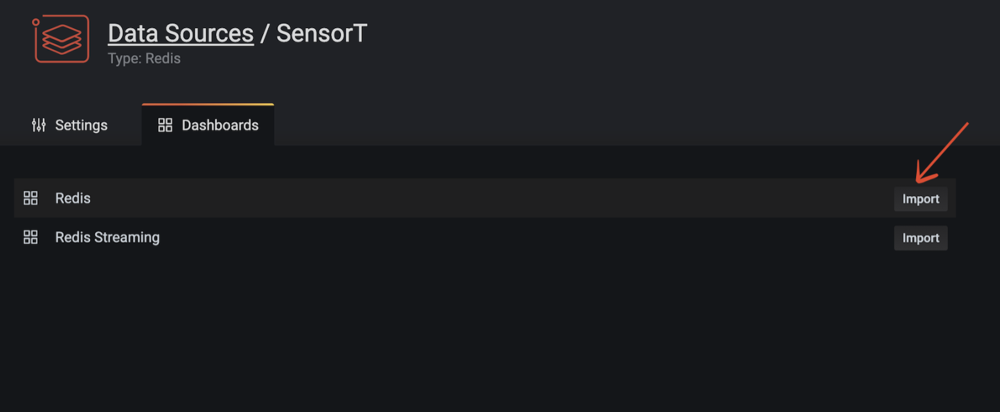

import Tabs from '@theme/Tabs';
import TabItem from '@theme/TabItem';
import Authors from '@site/src/theme/Authors';

<Authors frontMatter={frontMatter} />

The Redis Data Source for Grafana is a plug-in that allows users to connect to the Redis database and build dashboards in Grafana to easily monitor Redis and application data. It provides an out-of-the-box predefined dashboard, but also lets you build customized dashboards tuned to your specific needs.


## Features and Capabilities

- Grafana 7.1 and later with a new plug-in platform supported.
- Data Source can connect to any Redis database. No special configuration is required.
- Redis Cluster and Sentinel supported since version 1.2.
- Data Source supports:

  - [RedisTimeSeries](https://oss.redis.com/redistimeseries/): `TS.GET`, `TS.INFO`, `TS.MRANGE`, `TS.QUERYINDEX`, `TS.RANGE`
  - [RedisGears](https://oss.redis.com/redisgears/): `RG.DUMPREGISTRATIONS`, `RG.PYEXECUTE`, `RG.PYSTATS`
  - [RedisSearch](https://oss.redis.com/redisearch/): `FT.INFO`
  - [RedisGraph](https://oss.redis.com/redisgraph/): `GRAPH.QUERY`, `GRAPH.SLOWLOG`

<Tabs
  defaultValue="Homebrew"
  values={[
    {label: 'Using Homebrew', value: 'Homebrew'},
    {label: 'Docker', value: 'Docker'},
    {label: 'Docker Compose', value: 'Docker Compose'},
  ]}>
  <TabItem value="Homebrew">

#### Using Homebrew

#### Step 1. Install Grafana

```bash
 brew install grafana
```

#### Step 2. Install Redis Datasource

```bash
 grafana-cli plugins install redis-datasource
```

Homebrew downloads and untars the files into /usr/local/Cellar/grafana/version.

#### Step 3. Start Grafana service

```bash
 brew services start grafana
```

#### Step 4. Access Grafana dashboard

Open `https://IP:3000` to access grafana. The default username/password is admin/admin.



#### Step 5. Click "Configuration"


#### Step 6. Add Redis as a Data Source


#### Step 7. Select "Redis" as data source type


#### Step 8. Add Redis Database name, Endpoint URL and password

Assuming that you already have Redis server and database up and running in your infrastructure.
You can also leverage Redis Enterprise Cloud as showcased in the below example.


#### Step 9. Click "Import" under Dashboard



#### Step 10.Access the Redis datasource Dashboard


</TabItem>

<TabItem value="Docker">

#### Using Docker

You can install and run Grafana using the official Docker image.

#### Step 1. Install Docker

The first step is to install Docker for your operating system. Run the `docker version` command in a terminal window to make sure that Docker is installed correctly.

Note - On Windows and Mac, install Docker version 18.03 or higher. You can run `docker version` to find out your Docker version.

#### Step 2. Run Grafana Docker container

Specify the plugins you want installed to Docker as a comma-separated list in the `GF_INSTALL_PLUGINS` environment. This sends each plugin name to `grafana-cli plugins install ${plugin}` and installs them when Grafana starts.
In our case, we will be using redis-datasource.

```bash
 docker run -d -p 3000:3000 --name=grafana -e "GF_INSTALL_PLUGINS=redis-datasource" grafana/grafana
```

#### Step 3. Accessing the Grafana dashboard

Open `https://IP:3000` to access Grafana. The default username/password is admin/admin.


#### Step 4. Click "Configuration"


#### Step 5. Add Redis as a Data Source


#### Step 6. Select "Redis" as data source type


#### Step 7. Add Redis Database name, Endpoint URL and password

We'll assume that you already have a Redis server and up and running in your infrastructure.
You can also leverage Redis Enterprise Cloud as demonstrated below.


#### Step 8. Click "Import" under Dashboard


#### Step 9.Access the Redis datasource Dashboard


  </TabItem>
<TabItem value="Docker Compose">

#### Using Docker Compose

Assuming that Docker Compose is already installed in your system, follow these steps:

#### Step 1. Clone the repository

```bash
 git clone https://github.com/RedisGrafana/grafana-redis-datasource
 cd grafana-redis-datasource
```

#### Step 2. Execute the docker-compose CLI

The project provides a `docker-compose.yml` file tha starts Redis with all modules and Grafana.

```bash
 docker-compose up -d
```

#### Step 3. Access Grafana dashboard


#### Step 4. Click "Configuration"


#### Step 5. Add Redis as a Data Source


#### Step 6. Select "Redis" as data source type


#### Step 7. Add Redis Database name, Endpoint URL and password

We assume that you already have a Redis server up and running in your infrastructure.
You can also leverage Redis Enterprise Cloud as shown below:


#### Step 8. Click "Import" under Dashboard


#### Step 9.Access the Redis datasource Dashboard


</TabItem>
</Tabs>

#### Supported commands

Data Source supports various Redis commands using custom components and provides a unified interface to query any command.


<div class="text--center">
  <iframe
    width="760"
    height="415"
    src="https://www.youtube.com/embed/LquDQyEncLE"
    title="YouTube video player"
    frameborder="0"
    allow="accelerometer; autoplay; clipboard-write; encrypted-media; gyroscope; picture-in-picture"
    allowfullscreen></iframe>
</div>

### Further References

- [Introducing the Redis Data Source Plug-in for Grafana](https://redis.com/blog/introducing-the-redis-data-source-plug-in-for-grafana/)
- [How to Use the New Redis Data Source for Grafana Plug-in](https://redis.com/blog/how-to-use-the-new-redis-data-source-for-grafana-plug-in/)
- [3 Real-Life Apps Built with Redis Data Source for Grafana](https://redis.com/blog/3-real-life-apps-built-with-redis-data-source-for-grafana/)
- [How to Manage Real-Time IoT Sensor Data in Redis](https://redis.com/blog/how-to-manage-real-time-iot-sensor-data-in-redis/)
- [Real-time observability with Redis and Grafana](https://grafana.com/go/observabilitycon/real-time-observability-with-redis-and-grafana/)
